# Laporan Praktikum #10 POLIMORFISME

## Kompetensi

1. Memahami konsep dan bentuk dasar polimorfisme
2. Memahami konsep virtual method invication
3. Menerapkan polimorfisme pada pembuatan heterogeneous collection
4. Menerapkan polimorfisme pada parameter/argument method
5. Menerapkan object casting untuk meng-ubah bentuk objek

## Ringkasan Materi

untuk keseluruhan dalam menyelesaikan tugas yang di berikan dosen tidak ada masalah, mulai terbiasa dengan cara pengiriman 

## Percobaan

### Percobaan 1 (Bentuk dasar polimorfisme)

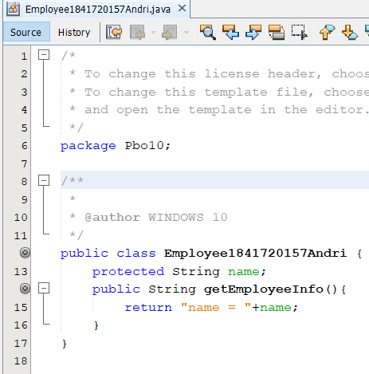
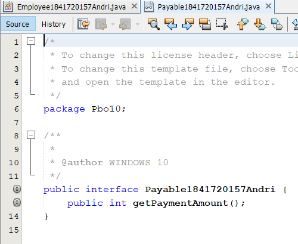
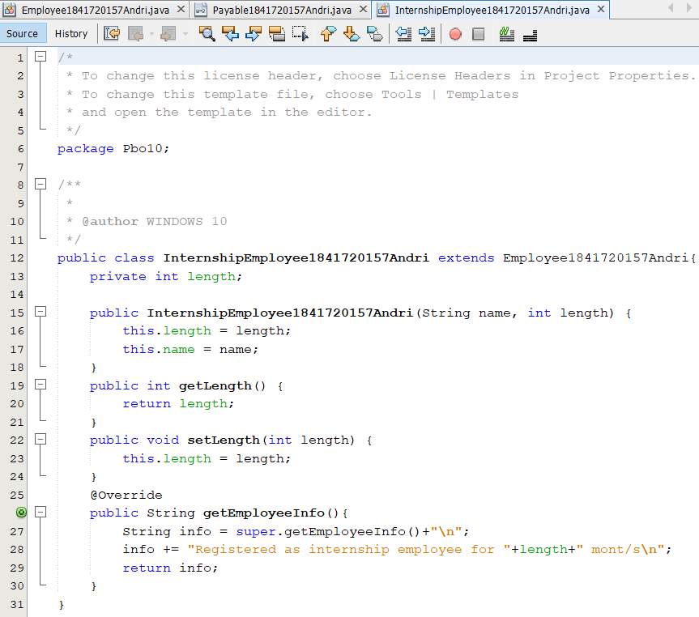
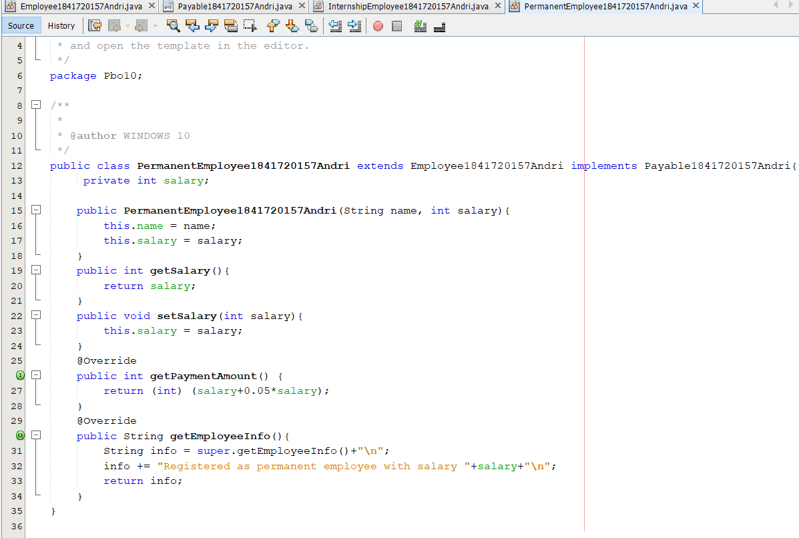
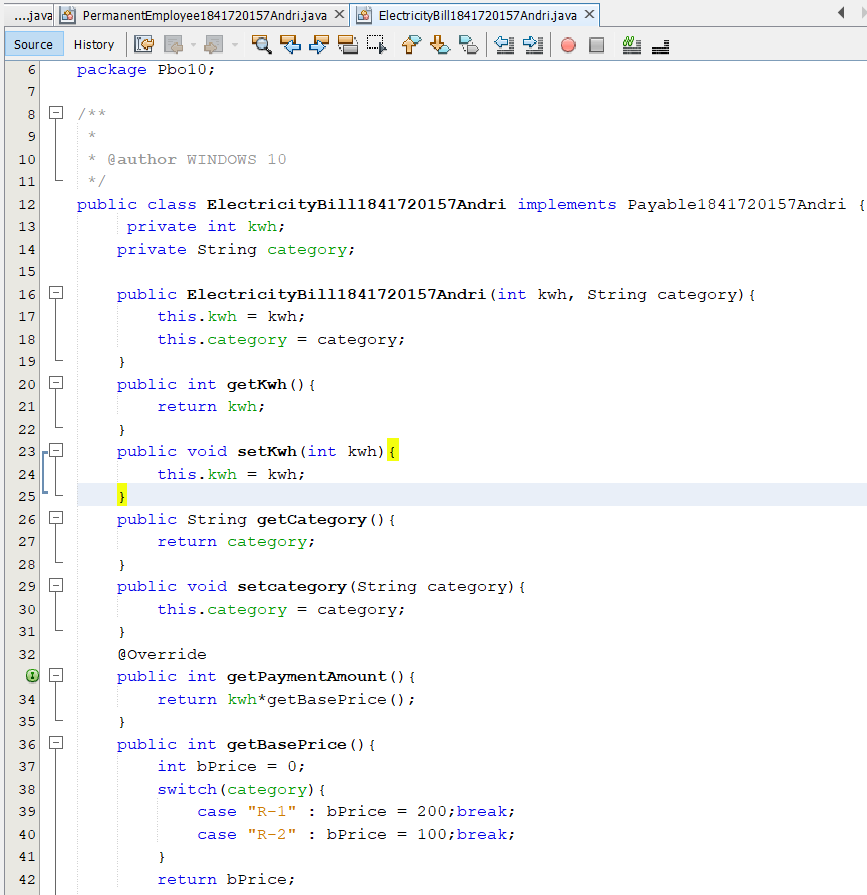
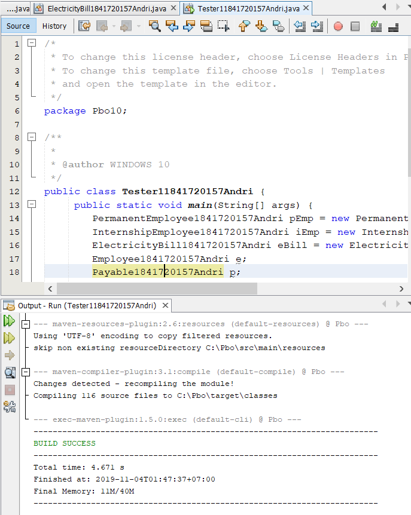

link kode program : [Program 1](../../src/10_Polimorfisme/Employee1841720157Andri.java)

link kode program : [Program 2](../../src/10_Polimorfisme/Payable1841720157Andri.java)

link kode program : [Program 3](../../src/10_Polimorfisme/InternshipEmployee1841720157Andri.java)

link kode program : [Program 4](../../src/10_Polimorfisme/PermanentEmployee1841720157Andri.java)

link kode program : [Program 5](../../src/10_Polimorfisme/ElectricityBill1841720157Andri.java)

link kode program : [Program 6](../../src/10_Polimorfisme/Tester11841720157Andri.java)

## pertanyaan
1. Class apa sajakah yang merupakan turunan dari class Employee?
2. Class apa sajakah yang implements ke interface Payable?
3. Perhatikan class Tester1, baris ke-10 dan 11. Mengapa e, bisa diisi
dengan objek pEmp (merupakan objek dari class
PermanentEmployee) dan objek iEmp (merupakan objek dari class
InternshipEmploye) ?
4. Perhatikan class Tester1, baris ke-12 dan 13. Mengapa p, bisa diisi
dengan objek pEmp (merupakan objek dari class
PermanentEmployee) dan objek eBill (merupakan objek dari class
ElectricityBill) ?
5. Coba tambahkan sintaks:
p = iEmp;
e = eBill;
pada baris 14 dan 15 (baris terakhir dalam method main) ! Apa yang
menyebabkan error?
6. Ambil kesimpulan tentang konsep/bentuk dasar polimorfisme!

Jawab:

1. Class internshipEmployee dan class PermanentEmployee
2. Class ElectricityBill dan Class PermanentEmployee
3. e dapat di isi dengan pEmp dan iEmp karena e(Employee) merupakan Class yang mewariskan turunan kepada pEmp (PermanentEmployee) dan iEmp (InternshipEmployee)
4. p bisa di isi dengan objek pEmp dan eBill karena class
pEmp(PermanentEmployee) dan eBill(ElectricityBill)
adalah class implements ke interface p(Payable)
5. Karena class iEmp(InternshipEmployee) tidak implements
ke interface p(Payable) dan eBill(electricityBill) bukan
class turunan dari class e(Employee)
6. Kesimpulannya adalah Polimorfisme merupakan
kemampuan suatu objek untuk memiliki banyak bentuk.
Penggunaan polimorfisme yang paling umum dalam OOP
terjadi ketika ada referensi super class yang digunakan
untuk merujuk ke objek dari sub class. Dengan kata lain,
ketika ada suatu objek yang dideklarasikan dari superclass,
maka objek tersebut bisa diinstansiasi sebagai objek dari
sub class.

### Percobaan 2 (Virtual method invocation)

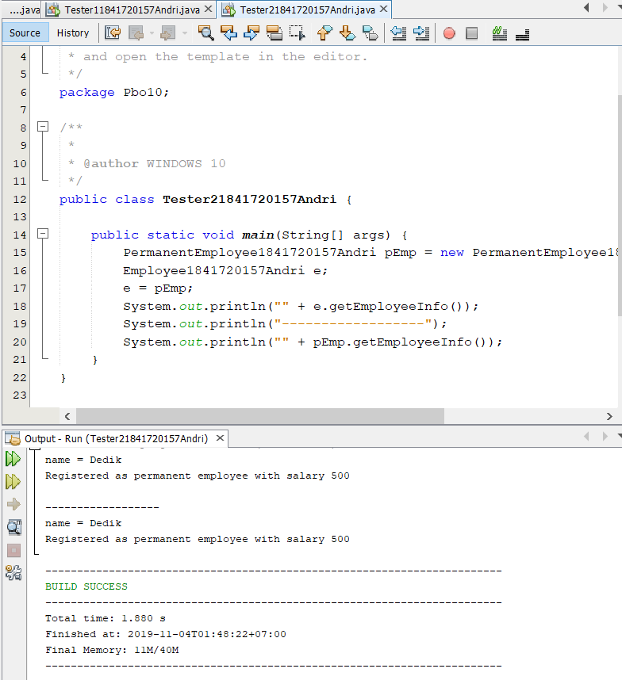

link kode program : [Program 1](../../src/10_Polimorfisme/Tester21841720157Andri.java)

## Pertanyaan
Soal
1. Perhatikan class Tester2 di atas, mengapa pemanggilan
e.getEmployeeInfo() pada baris 8 dan
pEmp.getEmployeeInfo() pada baris 10 menghasilkan hasil
sama?
2. Mengapa pemanggilan method e.getEmployeeInfo() disebut sebagai pemanggilan method virtual (virtual method invication), sedangkan pEmp.getEmployeeInfo() tidak?
3. Jadi apakah yang dimaksud dari virtual method invocation? Mengapa disebut virtual?

Jawab:

1. Karena pEmp(permanentsEmployee) merupakan class turunan e(Employee) dan method getEmployeeInfo() pada
class e dan pEmp merupakan overriding
2. Karena pada saat compile time,compiler akan mengenali method getEmployeInfo() yang akan dipanggil pada class e(Employee),namun saat run time,yang dijalankan oleh JVM justru method getEmployeeInfo() yang ada pada class pEmp(permanentsEmployee) maka dari itu disebut method virtual(virtual method invication)
3. Virtual method invocation terjadi ketika ada pemanggilan overriding method dari suatu objek polimorfisme. Disebut virtual karena antara method yang dikenali oleh compiler dan method yang dijalankan oleh JVM berbeda.

### Percobaan 3 (Heterogenous Collection)

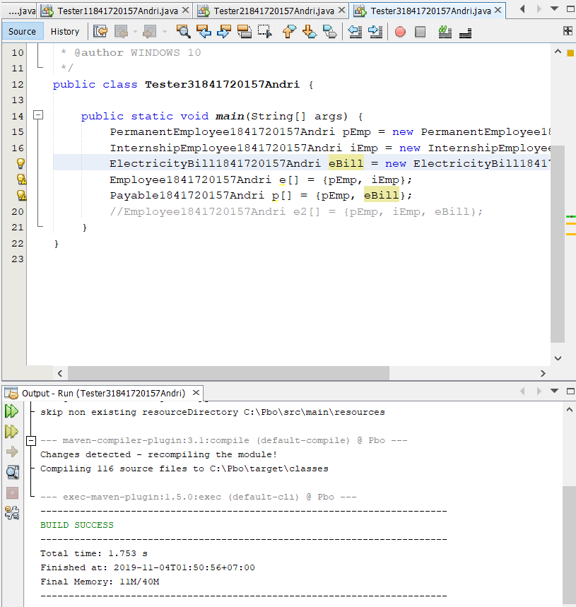

link kode program : [Program 1](../../src/10_Polimorfisme/Tester31841720157Andri.java)

### Pertanyaan
Soal
1. Perhatikan array e pada baris ke-8, mengapa ia bisa diisi dengan
objek-objek dengan tipe yang berbeda, yaitu objek pEmp (objek dari
PermanentEmployee) dan objek iEmp (objek dari
InternshipEmployee) ?
2. Perhatikan juga baris ke-9, mengapa array p juga biisi dengan objekobjek dengan tipe yang berbeda, yaitu objek pEmp (objek dari
PermanentEmployee) dan objek eBill (objek dari
ElectricityBilling) ?
3. Perhatikan baris ke-10, mengapa terjadi error?

Jawab

1. Karena dengan adanya konsep polimorfisme, maka variabel array bisa dibuat heterogen. Itulah kenapa array e dapat di isi dengan objek dengan tipe berbeda yaitu pEmp dan iEmp. Dan e(Employe) merupakan superclass dari pEmp dan iEmp
2. Sama seperti jawaban dari No 1 diatas, Karena dengan adanya konsep polimorfisme, maka variabel array bisa dibuat heterogen. Itulah kenapa array p dapat di isi dengan objek dengan tipe berbeda yaitu pEmp dan eBill. Dan p(Payable) mengimplements ke class pEmpdan eBill
3. Karena e(Employee) bukan superclass dari eBill(electricityBill)

### Percobaan 4 (Argumen polimorfisme, instanceod dan casting objek)

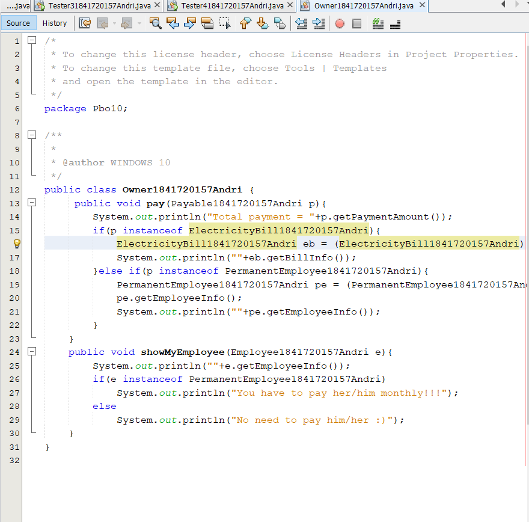
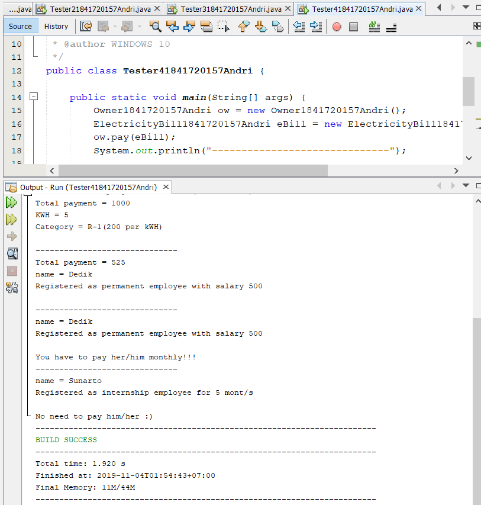

link kode program : [Program 1](../../src/10_Polimorfisme/Owner1841720157Andri.java)

link kode program : [Program 2](../../src/10_Polimorfisme/Tester41841720157Andri.java)

## Pertanyaan
Soal
1. Perhatikan class Tester4 baris ke-7 dan baris ke-11, mengapa
pemanggilan ow.pay(eBill) dan ow.pay(pEmp) bisa dilakukan,
padahal jika diperhatikan method pay() yang ada di dalam class
Owner memiliki argument/parameter bertipe Payable? Jika
diperhatikan lebih detil eBill merupakan objek dariElectricityBill dan pEmp merupakan objek dari
PermanentEmployee?
2. Jadi apakah tujuan membuat argument bertipe Payable pada
method pay() yang ada di dalam class Owner?
3. Coba pada baris terakhir method main() yang ada di dalam class
Tester4 ditambahkan perintah ow.pay(iEmp);
Mengapa terjadi error?
4. Perhatikan class Owner, diperlukan untuk apakah sintaks p
instanceof ElectricityBill pada baris ke-6 ?
5. Perhatikan kembali class Owner baris ke-7, untuk apakah casting
objek disana (ElectricityBill eb = (ElectricityBill) p)
diperlukan ? Mengapa objek p yang bertipe Payable harus di-casting
ke dalam objek eb yang bertipe ElectricityBill ?

JAwab

1. Karena eBill dan pEmp implements kepada Payable itulah kenapa ow.pay(eBill) dan ow.pay(pEmp) bisa dilakukan
2. Agar ow.pay(eBill) dan ow.pay(pEmp) dapat di lakukan
3. Karena iEmp tidak implements kepada Payable sedangkan ow memiliki parameter bertipe Payable
4. Di perlukan sintaks p instanceof ElectricityBill karena operator instanceof bisa digunakan untuk mengecek apakah suatu objek merupakan hasil instansiasi dari suatu class tertentu.
5. Karena casting objek digunakan untuk mengubah tipe dari suatu objek. Jika ada suatu objek dari subclass kemudian tipenya diubah ke superclass. maka dari itu objek p bertipe Payable harus dicasting ke dalam objek eb yang bertipe ElectricityBill

## Tugas

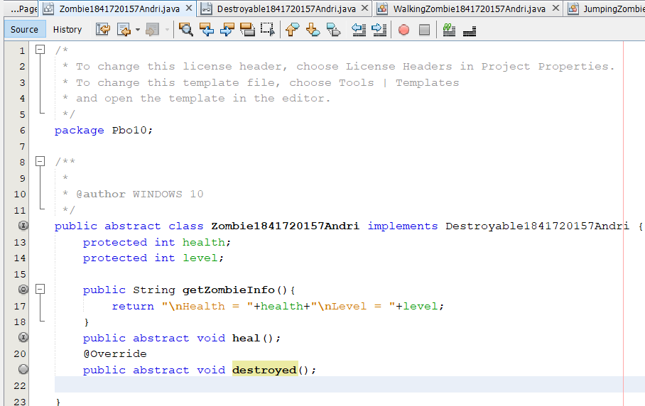
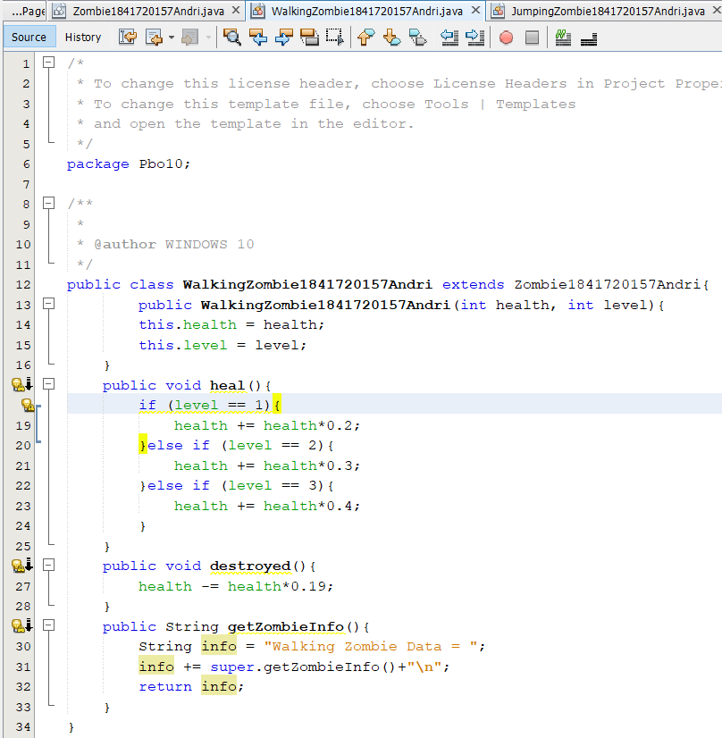
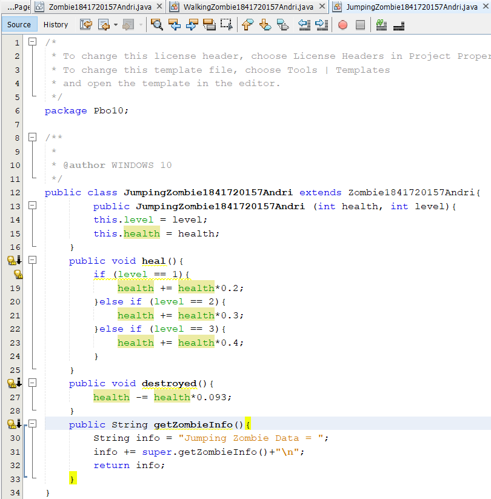
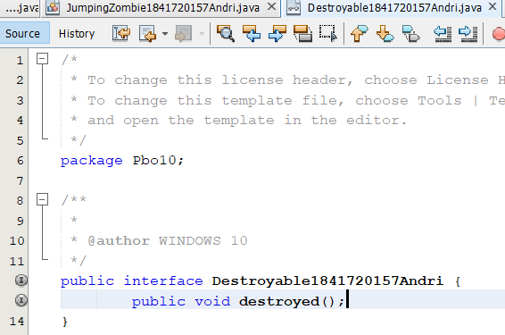
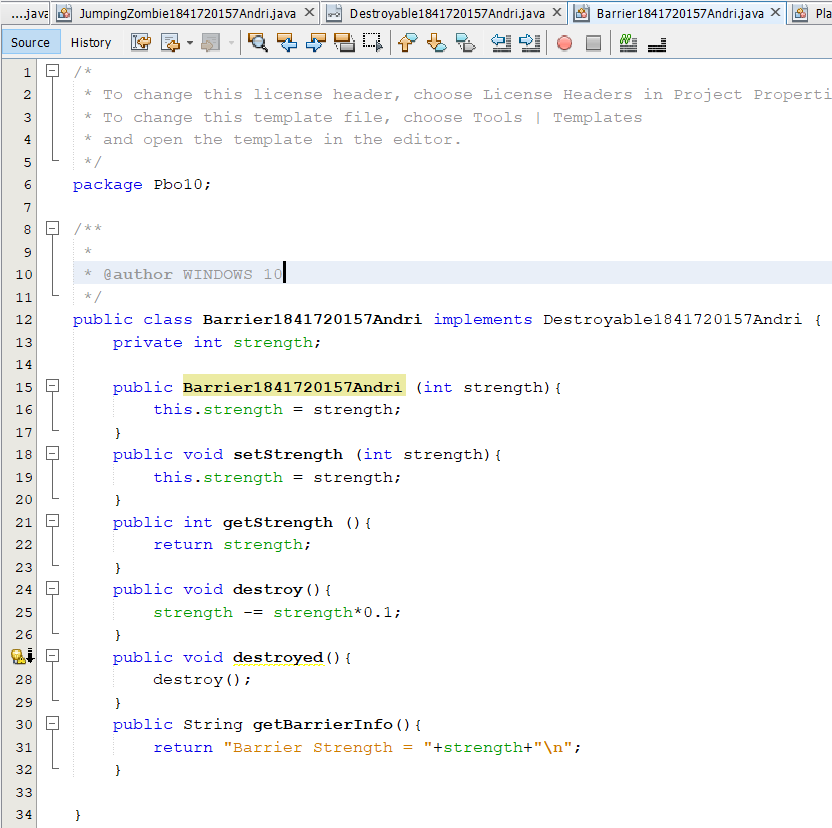
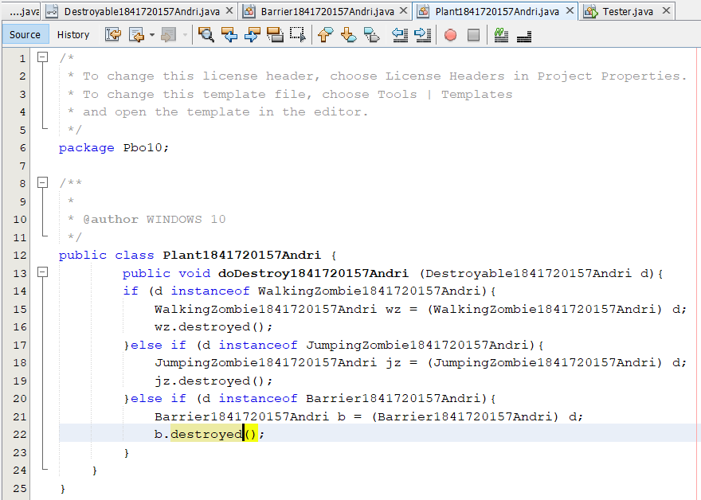
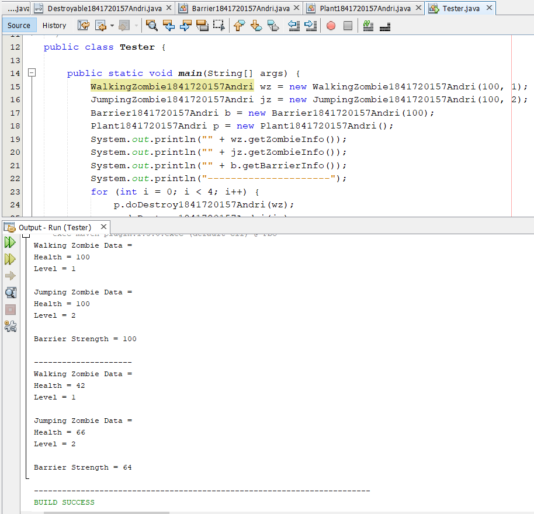

link kode program : [Program 1](../../src/10_Polimorfisme/Zombie1841720157Andri.java)

link kode program : [Program 2](../../src/10_Polimorfisme/WalkingZombie1841720157Andri.java)

link kode program : [Program 3](../../src/10_Polimorfisme/JumpingZombie1841720157Andri.java)

link kode program : [Program 4](../../src/10_Polimorfisme/Destroyable1841720157Andri.java)

link kode program : [Program 5](../../src/10_Polimorfisme/Barrier1841720157Andri.java)

link kode program : [Program 6](../../src/10_Polimorfisme/Plant1841720157Andri.java)

link kode program : [Program 7](../../src/10_Polimorfisme/Tester.java)

## Kesimpulan

Polimorfisme terdiri dari konsep-konsep dasar,konsep virtual method invication,serta polimorfisme dapat diterapkan pada pembuatan heterogeneous collection,parameter/argument method,serta object casting untuk mengubah bentuk object

## Pernyataan Diri

Saya menyatakan isi tugas, kode program, dan laporan praktikum ini dibuat oleh saya sendiri. Saya tidak melakukan plagiasi, kecurangan, menyalin/menggandakan milik orang lain.

Jika saya melakukan plagiasi, kecurangan, atau melanggar hak kekayaan intelektual, saya siap untuk mendapat sanksi atau hukuman sesuai peraturan perundang-undangan yang berlaku.

Ttd,

***(ANDRI YOGA SUSILA)***