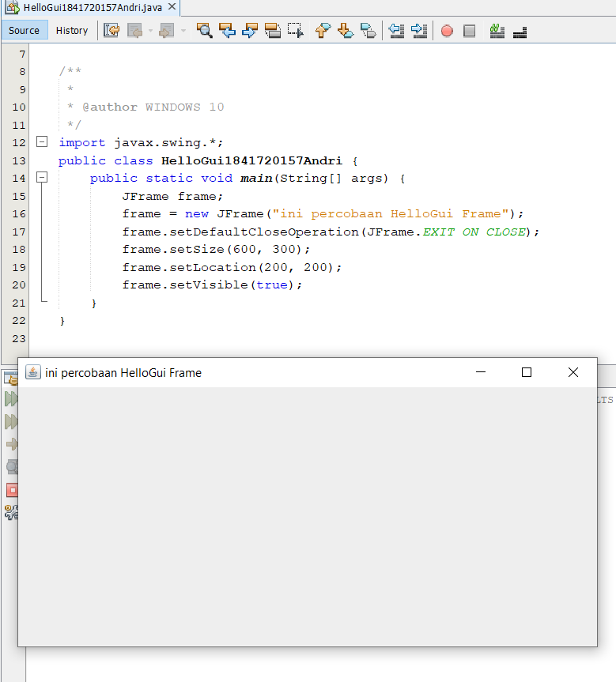

# Laporan Praktikum #11 GUI (Graphical User Interface)

## Kompetensi

1. Membuat aplikasi Graphical User Interface sederhana dengan bahasa pemrograman java;
2. Mengenal komponen GUI seperti frame, label, textfield, combobox, radiobutton, checkbox,textarea, menu, serta table;
3. Menambahkan event handling pada aplikasi GUI.

## Ringkasan Materi

pada jobsheet ini saya jadi lebih tau mekanisme pembuatan kalkulator menggunakan GUI, dan bisa membuat semacam aplikasi menggunakan GUI di netsbeans

## Percobaan

### Percobaan 1 (JFrame HelloGUI)

link kode program : [Program 1](../../src/11_GUI/HelloGui1841720157Andri.java)

### Percobaan 2 (Menangani Input Pada GUI)

link kode program : [Program 1](../../src/11_GUI/MyInputForm1841720157Andri.java)

### Percobaan 3 (Manajemen Layout)

link kode program : [Program 1](../../src/11_GUI/Border1841720157Andri.java)

link kode program : [Program 2](../../src/11_GUI/Box1841720157Andri.java)

link kode program : [Program 3](../../src/11_GUI/Grid1841720157Andri.java)

link kode program : [Program 4](../../src/11_GUI/LayoutGUI1841720157Andri.java)

### Pertanyaan
Soal
1. Apa perbedaan dari Grid Layout, Box Layout dan Border Layout?
2. Apakah fungsi dari masing-masing kode berikut?

Jawab

1. Grid Layout : membuat layout dengan satu kolom per komponen, hanya satu baris yang digunakan
Box Layout : menempatkan komponen dalam satu baris atau satu kolom
Border Layout : menyusun komponen berdasarkan lokasi geografis :  NORH, SOUTH, WEST, EAST, CENTER

2. Untuk menampilkan class Border
   Untuk menampilkan class Grid
   Untuk menampilkan class Box

### Percobaan 4 (Membuat GUI Melalui IDE Netbeans)

link kode program : [Program 1](../../src/11_GUI/Swing1841720157Andri.java)

link kode program : [Program 2](../../src/11_GUI/Swing1841720157Andri.form)

## Pertanyaan
Soal

1. Apakah fungsi dari kode berikut?
2. Mengapa pada bagian logika checkbox dan radio button digunakan multiple if ?
3. Lakukan modifikasi pada program untuk melakukan menambahkan inputan berupa alamat dan berikan fungsi pemeriksaan pada nilai Alamat tersebut jika belum diisi dengan menampilkan pesan peringatan

Jawab

1. menampilkan dari Jframe form
2. Karena , agar ceklis atau raddio buttonnya hanya muncul 1 tanda saja
3. 

### Percobaan 5 (JTabPane, JTtree, JTable)

link kode program : [Program 1](../../src/11_GUI/Swing2.java)

link kode program : [Program 2](../../src/11_GUI/Swing2.form)

### Pertanyaan
Soal
1. Apa kegunaan komponen swing JTabPane, JTtree, pada percobaan 5?
2. Modifikasi program untuk menambahkan komponen JTable pada tab Halaman 1 dan tab Halaman 2
Jawab

1. digunakan untuk tampilan atau background nya untuk mengisi pada setiap halaman, JTree digunakan untuk menyimpan pada tambah jika button tambahnya digunakan
2. 
## Tugas

link kode program : [Program 1](../../src/11_GUI/Calculator.java)

link kode program : [Program 2](../../src/11_GUI/Calculator.form)

## Kesimpulan

Dapat Membuat aplikasi Graphical User Interface sederhana dengan bahasa pemrograman java, datpat Mengenal komponen GUI seperti frame, label, textfield, combobox, radiobutton, checkbox,textarea, menu, serta table.

## Pernyataan Diri

Saya menyatakan isi tugas, kode program, dan laporan praktikum ini dibuat oleh saya sendiri. Saya tidak melakukan plagiasi, kecurangan, menyalin/menggandakan milik orang lain.

Jika saya melakukan plagiasi, kecurangan, atau melanggar hak kekayaan intelektual, saya siap untuk mendapat sanksi atau hukuman sesuai peraturan perundang-undangan yang berlaku.

Ttd,

***(ANDRI YOGA SUSILA)***