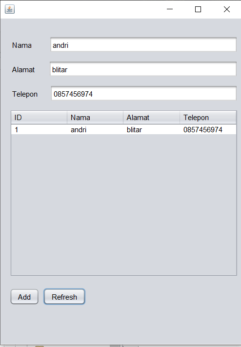

# Laporan Praktikum #12 (Collection (List, Set, Map) dan Database)

## Kompetensi

1. Memahami cara penyimpanan objek menggunakan Collection dan Map.
2. Mengetahui pengelompokan dari Collection.
3. Mengetahui perbedaan dari interface Set, List dan Map.
4. Mengetahui penggunaan class-class dari interface Set, List, dan Map.
5. Memahami koneksi database menggunakan JDBC dan JDBC API

## Ringkasan Materi

pada jobsheet ini saya jadi lebih tau mekanisme pembuatan aplikasi menggunakan GUI, dan bisa membuat semacam aplikasi menggunakan GUI di netsbeans

## Percobaan

### Percobaan 1 (Set)

link kode program : [Program 1](../../src/12_Java_API/CobaHashSet1841720157Andri.java)

## Pertanyaan

Soal
1. Apakah fungsi import java.util.*; pada program diatas!
2. Pada baris program keberapakah yang berfungsi untuk menciptakan object HashSet?
3. Apakah fungsi potongan program dibawah ini pada percobaan 1!
4. Tambahkan set.add(“Malang”); kemudian jalankan program! Amati hasilnya dan jelaskan
mengapa terjadi error!
5. Jelaskan fungsi potongan program dibawah ini pada percobaan 1!

Jawab

1. Fungsi dari import.java.util.*; pada program di atas adalah untuk mengimpor semua class pada Java

2. Pada baris program Set set = new HashSet() pada class DemoHashSet

3. Fungsi potongan program tesebut adalah untuk menambahkan suatu objek pada set hash

4. Karena sebelumnya sudah pernah mengisi data dengan nama “ Malang ” , maka data yang sama yang ditambahkan tidak akan terdaftar

5. Iterator digunakan untuk mengakses dan menampilkan nilai beserta tambahan method lain yang didefinisikan di dalam interface Iterator.
Kode tersebut juga digunakan untuk menampilkan nilai dengan lower case

### Percobaan 2 (List)

link kode program : [Program 1](../../src/12_Java_API/CobaArrayList1841720157Andri.java)

## Pertanyaan

Soal

1. Apakah fungsi potongan program dibawah ini!
2. Ganti potongan program pada soal no 1 menjadi sebagai berikut
3. Jelaskan perbedaan menampilkan data pada ArrayList menggunakan potongan program pada
soal no 1 dan no 2!

Jawab

1.  •	System.out.println(mListCountry); Digunkana untuk menampilkan semua data yang berada di objek mListCountry

    •	System.out.format("List index 0 = %s\n", mListCountry.get(0)); 
System.out.format("List index 2 = %s\n", mListCountry.get(2));
Digunakan untuk menampilkan data index ke-0 dan ke-2 pada objek mListCountry

2.  

3. Dimana output no 1 akan menampilkan data dengan interface list dan no 2 akan menampilkan dengan interface iterator

### Percobaan 3 (Map)

link kode program : [Program 1](../../src/12_Java_API/DemoHashMap1841720157Andri.java)

### Pertanyaan
Soal

1. Jelaskan fungsi hMapItem.put("1","Biskuit") pada program!
2. Jelaskan fungsi hMapItem.size() pada program!
3. Jelaskan fungsi hMapItem.remove("1") pada program!
4. Jelaskan fungsi hMapItem.clear() pada program!
6. Jalankan program dan amati apa yang terjadi!
7.  Apakah perbedaan program sebelumnya dan setelah ditambahkan kode program pada soal no 5 diatas? Jelaskan

Jawab

1. Memasukkan data Biskuit dan menaruhnya pada key no 1

2. Untuk mengecek jumlah data yang ada

3. Menghapus data yang ada pada key no 2

4. Menghapus semua data yang ada di HashMap

6. 

7. Perbedaannya setelah ditambahkan kode program tersebut adalah adanya penampilan data menggunakan iterator

### Percobaan 4 (Implementasi ArrayList dalam GUI)

link kode program : [Program 1](../../src/12_Java_API/Mahasiswa1841720157Andri.java)

link kode program : [Program 2](../../src/12_Java_API/InputData1841720157Andri.java)

link kode program : [Program 3](../../src/12_Java_API/TampilGui1841720157Andri.java)

link kode program : [Program 4](../../src/12_Java_API/TampilGui1841720157Andri.form)

### Percobaan 5 (Aplikasi Biodata)

ini adalah Tampilan setelah di klik tombol Add

ini adalah Tampilan setelah di klik tombol Refresh

link kode program : [Program 1](../../src/12_Java_API/FormKoneksi1841720157Andri.java)

link kode program : [Program 2](../../src/12_Java_API/FormKoneksi1841720157Andri.form)

### Pertanyaan
Soal

5. Setelah menambah code pada action button klik, coba jalankan program dan tambahkan
data. Apakah program berhasil menambahkan data? Jika tidak apakah penyebabnya.
6. Jelaskan maksud source code untuk melakukan insert data diatas?
9. Jelaskan alur dari method ambil_data_tabel?

Jawab

5. Tidak dapat menambah data, karena belum memasukkanlibrary sql di class yang dibuat

6. Insert into anggota(nama, alamat, telp) untuk menentukan kolom mana yang akan diisi dan values dan getText() setiap nama field adalah data yang nantinya akan dimasukkan ke table anggota dan urutannya sesuai dengan kolom yang ditentukan sebelumnya

9. ambil_data_tabel yaitu pertama memasukkan method buka_koneksi agar bisa terhubung dengan database lalu memanggil semua data dengan syntax Select * from anggota kemudian semua data tersebut dimasukkan ke ResultSet kemudia kita cek dengan syntax next untuk mengambil data yang ada di database jika ada akan di taruh ke addRow 

## Kesimpulan

 dapat Memahami cara penyimpanan objek menggunakan Collection dan Map.dan juga bisa Mengetahui pengelompokan dari Collection,Mengetahui perbedaan dari interface Set, List dan Map,Mengetahui penggunaan class-class dari interface Set, List, dan Map.

## Pernyataan Diri

Saya menyatakan isi tugas, kode program, dan laporan praktikum ini dibuat oleh saya sendiri. Saya tidak melakukan plagiasi, kecurangan, menyalin/menggandakan milik orang lain.

Jika saya melakukan plagiasi, kecurangan, atau melanggar hak kekayaan intelektual, saya siap untuk mendapat sanksi atau hukuman sesuai peraturan perundang-undangan yang berlaku.

Ttd,

***(ANDRI YOGA SUSILA)***