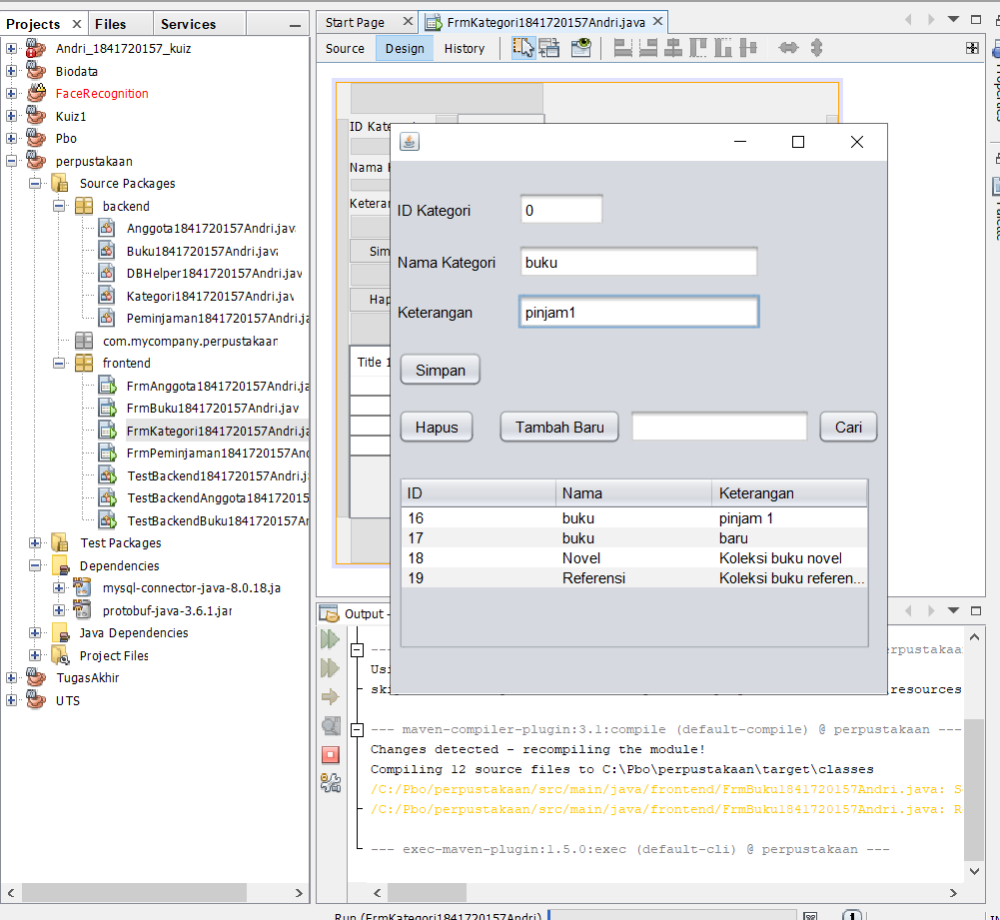

# Laporan Praktikum #14 (GUI dan Database)

## Kompetensi

1. Menggunakan paradigma berorientasi objek untuk interaksi dengan database
2. Membuat backend dan frontend
3. Membuat form sebagai frontend

## Ringkasan Materi

pada jobsheet ini saya jadi lebih tau mekanisme pembuatan aplikasi menggunakan GUI, dan bisa membuat semacam aplikasi menggunakan GUI di netsbeans

### Percobaan 1 (Membuat database)

link kode program : [Program 1](../../src/14_GUI_dan_Database/dbperpus.sql)

### Percobaan 2 (Mempersiapkan project)

membuat package folder frontend dan ackend

### Percobaan 3 (Membuat class helper untuk mengeksekusi query SQL)

link kode program : [Program 1](../../src/14_GUI_dan_Database/DBHelper1841720157Andri.java)

### Percobaan 4 (Membuat class Kategori untuk menghandle CRUD pada tabel kategori)

link kode program : [Program 1](../../src/14_GUI_dan_Database/Kategori1841720157Andri.java)

### Percobaan 5 

link kode program : [Program 1](../../src/14_GUI_dan_Database/TestBackend1841720157Andri.java)

### Percobaan 6.1

link kode program : [Program java](../../src/14_GUI_dan_Database/FrmKategori1841720157Andri.java)

link kode program : [Program form](../../src/14_GUI_dan_Database/FrmKategori1841720157Andri.form)

### Percobaan 6.2

link kode program : [Program java](../../src/14_GUI_dan_Database/Anggota1841720157Andri.java)

### Percobaan 7.1 

link kode program : [Program java](../../src/14_GUI_dan_Database/FrmAnggota1841720157Andri.java)

### Percobaan 7.2

link kode program : [Program java](../../src/14_GUI_dan_Database/Buku1841720157Andri.java)

### Percobaan 8

link kode program : [Program java](../../src/14_GUI_dan_Database/FrmBuku1841720157Andri.java)

link kode program : [Program form](../../src/14_GUI_dan_Database/FrmBuku1841720157Andri.form)

### Tugas

Class Peminjaam

form Peminjaman

link kode program : [Program java](../../src/14_GUI_dan_Database/Peminjaman1841720157Andri.java)

link kode program : [Program java](../../src/14_GUI_dan_Database/FrmPeminjaman1841720157Andri.java)

link kode program : [Program form](../../src/14_GUI_dan_Database/FrmPeminjaman1841720157Andri.form)

## Kesimpulan

Kita dapat memahami konsep dan bentuk dasar polimorfisme,Kita dapat memahami konsep virtual method invication,kita dapat menerapkan polimorfisme pada pembuatan heterogeneous collection,Kita dapat menerapkan polimorfisme pada parameter/argument method,Kita dapat menerapkan object casting untuk meng-ubah bentuk objek

## Pernyataan Diri

Saya menyatakan isi tugas, kode program, dan laporan praktikum ini dibuat oleh saya sendiri. Saya tidak melakukan plagiasi, kecurangan, menyalin/menggandakan milik orang lain.

Jika saya melakukan plagiasi, kecurangan, atau melanggar hak kekayaan intelektual, saya siap untuk mendapat sanksi atau hukuman sesuai peraturan perundang-undangan yang berlaku.

Ttd,

***(ANDRI YOGA SUSILA)***