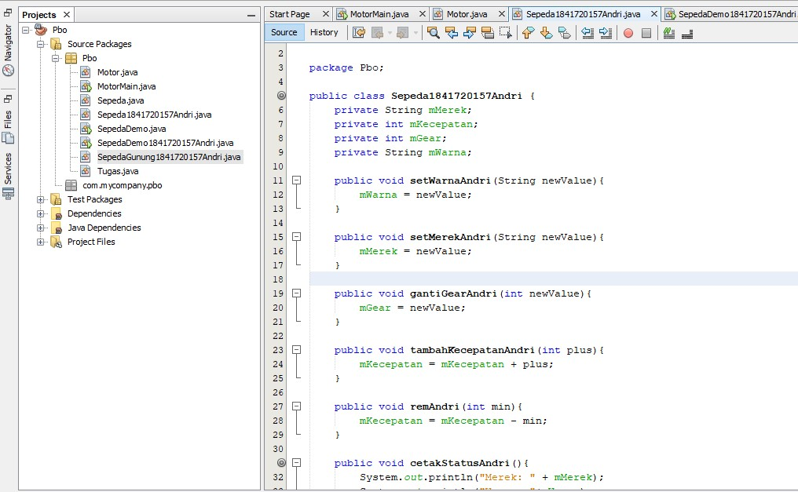
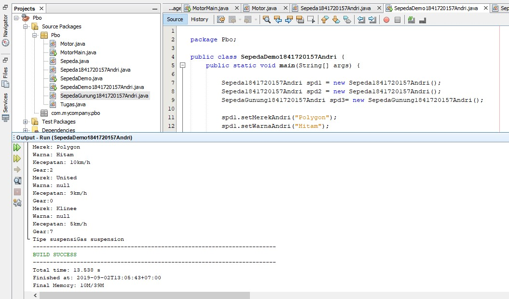
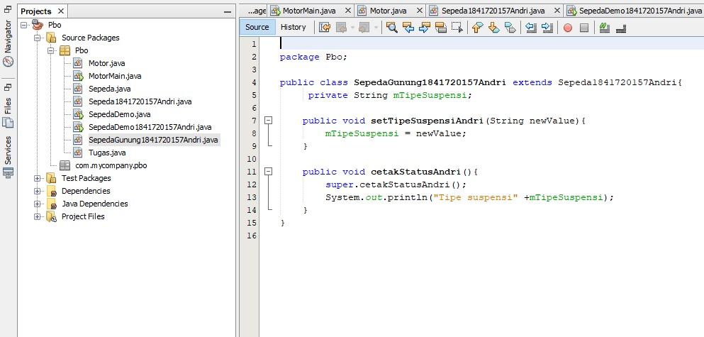
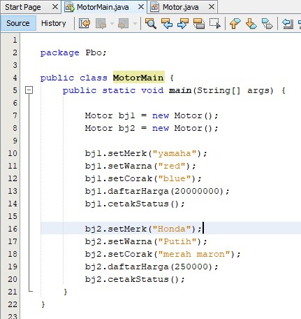
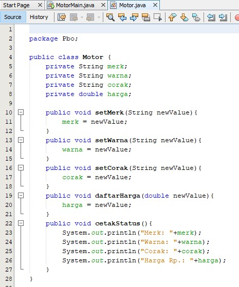
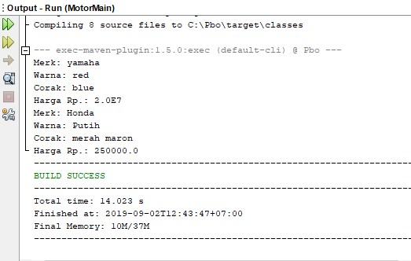

# Laporan Praktikum #1 - Pengantar Konsep PBO

## Kompetensi

1. Perbedaan paradigma berorientasi objek dengan paradigma struktural
2. Konsep dasar PBO

12345678890

## Ringkasan Materi

untuk keseluruhan dalam menyelesaikan tugas yang di berikan dosen tidak ada masalah, cuman agak sedikit bingung cara mengirimnya dan format"nya agak membingungkan. 

## Percobaan

### Percobaan 1

(memberitahu bagaimana cara membuat class, object, kemudian mengakses method pada dalam kelas tertentu)

Contoh link kode program : [ini contoh link ke kode program](../../src/Sepeda1841720157Andri.java)
Contoh link kode program : [ini contoh link ke kode program](../../src/SepedaDemo1841720157Andri.java)

### Percobaan 2

(memperkenalkan inheritance dalam PBO)

Contoh link kode program : [ini contoh link ke kode program](../../src/1_Pengantar_Konsep_PBO/SepedaDemo1841720157Andri.java)
Contoh link kode program : [ini contoh link ke kode program](../../src/1_Pengantar_Konsep_PBO/SepedaGunung1841720157Andri.java)

## Pertanyaan

Pertanyaan
1. Sebutkan dan jelaskan aspek-aspek yang ada pada pemrograman berorientasi objek! 
2. Apa yang dimaksud dengan object dan apa bedanya dengan class? 
3. Sebutkan salah satu kelebihan utama dari pemrograman berorientasi objek dibandingkan dengan pemrograman  tructural! 
4. Pada class Sepeda, terdapat state/atribut apa saja? 
5. Tambahkan atribut warna pada class Sepeda. 
6. Mengapa pada saat kita membuat class SepedaGunung, kita tidak perlu membuat class nya dari nol? 

## Jawaban pertanyaan
1)	Aspek-aspek yang ada pemrograman berbasis objek adalah:

a. Object
Objek memiliki state dan behaviour. State adalah ciri-ciri atau atribut dari objek tersebut. Misal objek Sepeda, memiliki state merek, kecepatan, gear dan sebagainya. Sedangkan behaviour adalah perilaku yang dapat dilakukan objek tersebut. Misal pada Sepeda, behaviournya antara lain, tambah kecepatan, pindah gear, kurangi kecepatan, belok, dan sebagainya. 
b. Class
Class adalah blueprint atau prototype dari objek. Ambil contoh objek sepeda. Terdapat berbagai macam sepeda di dunia, dari berbagai merk dan model. Namun semua sepeda dibangun berdasarkan blueprint yang sama, sehingga tiap sepeda memiliki komponen dan karakteristik yang sama. Sepeda yang anda miliki dirumah, adalah hasil instansiasi dari class sepeda.
c. Enkapsulasi
Disebut juga dengan information-hiding. Dalam berinteraksi dengan objek, seringkali kita tidak perlu mengetahui kompleksitas yang ada didalamnya. Contoh pada sepeda, ketika kita mengganti gear pada sepeda, kita tinggal menekan tuas gear yang ada di grip setang sepeda saja. Kita tidak perlu mengetahui bagaimana cara gear berpindah secara teknis. 
d. Inheritance
Disebut juga pewarisan. Inheritance memungkinkan kita untuk mengorganisir struktur program dengan natural. Inheritance juga memungkinkan kita untuk memperluas fungsionalitas program tanpa harus mengubah banyak bagian program.
e. Polimorfisme
Polimorfisme juga meniru sifat objek di dunia nyata, dimana sebuah objek dapat memiliki bentuk, atau menjelma menjadi bentuk-bentuk lain.

2) Yang dimaksud objek adalah suatu rangkaian dalam program yang memiliki state dan behavior atau bisa disebut ciri-ciri dan perilaku dari suatu objek misalnya, nama dan sebagainya dan perilakunya. Sedangkan class adalah blueprint dari objek misalnya, ada banyak kendaraan yang ada di dunia ini sebagai contohnya adalah pesawat yang memiliki berbagai macam merk dan model, tetapi pesawat tetap dibuat dengan blueprint yang sama.

3) Salah satu kelebihan dari PBO dibandingan dengan pemrograman structural ialah program dapat lebih fleksibel dan modular.

4)	atribut merk, atribut kecepatan, dan gear.

5) 

6)	karena pada class SepedaGunung terdapat komponen tambahan meskipun class SepedaGunung tersebut diwariskan dari class Sepeda.

## Tugas

(silakan kerjakan tugas di sini beserta `screenshot` hasil kompilasi program. Jika ada rujukan ke file program, bisa dibuat linknya di sini.)

Contoh link kode program : [ini contoh link ke kode program](../../src/Motor.java)
Contoh link kode program : [ini contoh link ke kode program](../../src/MotorMain.java)

## Kesimpulan

Dari percobaan diatas, kita telah mendemonstrasikan bagaimana paradigma pemrograman berorientasi objek dan mengimplementasikannya kedalam program sederhana. Kita juga telah mendemonstrasikan salah satu fitur paling penting dari PBO yaitu inheritance, yaitu dalam hal membuat class SepedaGunung.
Kita ketahui bahwa SepedaGunung pada dasarnya adalah sama dengan Sepeda (memiliki gear,
memiliki kecepatan, dapat menambah kecepatan, dapat mengerem, pindah gigi, dsb) namun ada
fitur tambahan yaitu tipe suspensi. Maka kita tidak perlu membuat class SepedaGunung dari nol,
kita extends atau wariskan saja dari class Sepeda, kemudian kita tinggal tambahkan fitur yang
sebelumnya belum ada di class Sepeda. Inilah salah satu kelebihan PBO yang tidak ada di
pemrograman struktural

## Pernyataan Diri

Saya menyatakan isi tugas, kode program, dan laporan praktikum ini dibuat oleh saya sendiri. Saya tidak melakukan plagiasi, kecurangan, menyalin/menggandakan milik orang lain.

Jika saya melakukan plagiasi, kecurangan, atau melanggar hak kekayaan intelektual, saya siap untuk mendapat sanksi atau hukuman sesuai peraturan perundang-undangan yang berlaku.

Ttd,

***(ANDRI YOGA SUSILA)***