# Laporan Praktikum #2 - Class Dan Object

## Kompetensi

1) Mahasiswa dapat memahami deskripsi dari class dan object
2) Mahasiswa memahami implementasi dari class
3) Mahasiswa dapat memahami implementasi dari attribute
4) Mahasiswa dapat memahami implementasi dari method
5) Mahasiswa dapat memahami implementasi dari proses instansiasi
6) Mahasiswa dapat memahami implementasi dari try-catch
7) Mahasiswa dapat memahami proses pemodelan class diagram menggunakan UML

## Ringkasan Materi

untuk keseluruhan dalam menyelesaikan tugas yang di berikan dosen tidak ada masalah, mulai terbiasa dengan cara pengiriman 

## Percobaan

### Percobaan 1

(Membuat Class Diagram)

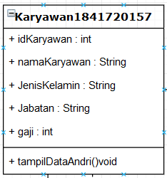

Soal
2. Sebutkan Class apa saja yang bisa dibuat dari studi kasus 1!,
3. Sebutkan atribut beserta tipe datanya yang dapat diidentifikasi dari masing-masing
class dari studi kasus 1!
4. Sebutkan method-method yang sudah anda buat dari masing-masing class pada studi
kasus 1

Jawab
2. - Class Karyawan1841720157Andri
   - Class TestKaryawan1841720157Andri

3. - idKaryawan : int
   - namaKaryawan : int
   - jenisKelamin : String
   - jabatan : String
   - gaji : int

4. -tampilDataAndri():

### Percobaan 2

( Membuat dan mengakses anggota suatu class)

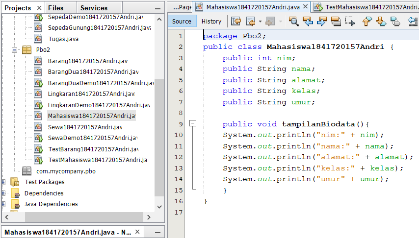
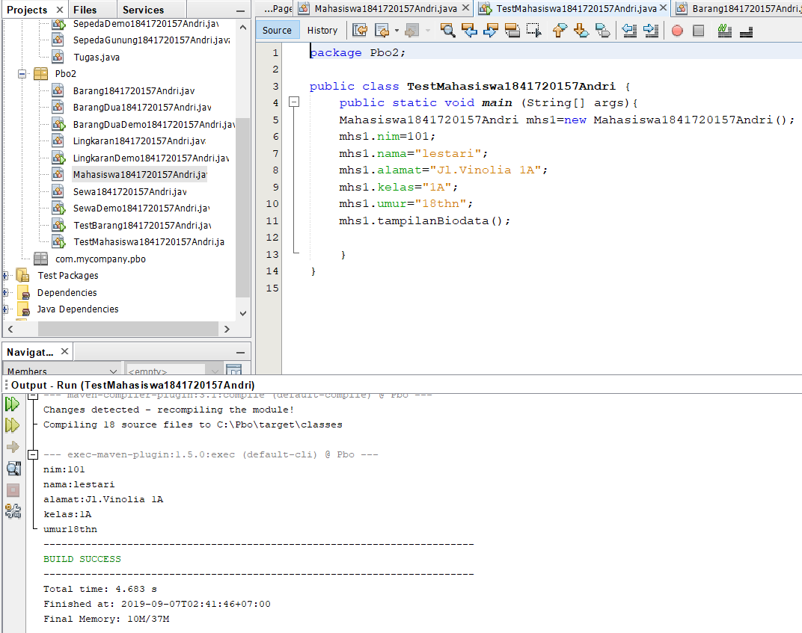

Contoh link kode program : [Program 1](../../src/2_Class_dan_Object/Mahasiswa1841720157Andri.java)
Contoh link kode program : [Program 2](../../src/2_Class_dan_Object/TestMahasiswa1841720157Andri.java)

Soal
7. Jelaskan pada bagian mana proses pendeklarasian atribut pada program diatas!
8. Jelaskan pada bagian mana proses pendeklarasian method pada program diatas!
9. Berapa banyak objek yang di instansiasi pada program diatas!
10. Apakah yang sebenarnya dilakukan pada sintaks program “mhs1.nim=101” ?
11. Apakah yang sebenarnya dilakukan pada sintaks program “mhs1.tampilBiodata()”? 
12. Instansiasi 2 objek lagi pada program diatas!

jawab

7. public class Mahasiswa1841720157{
    public int nim;
    public String nama;
    public String alamat;
    public String kelas;
}

8. public void  tampilBiodataAndri(){
    System.out.println("Nim    : "+nim);
    System.out.println("Nama    : "+nama);
    System.out.println("Alamat    : "+alamat);
    System.out.println("Kelas    : "+kelas);
}

9. object yang di instansi hanya ada 1 yaitu 
    Mahasiswa1841720157Andri mhs1=new Mahasiswa1841720157Andri();

10. mengisi data nim

11. memanggil method tampilBiodata(); untuk memanggil biodata mahasiswa

12. 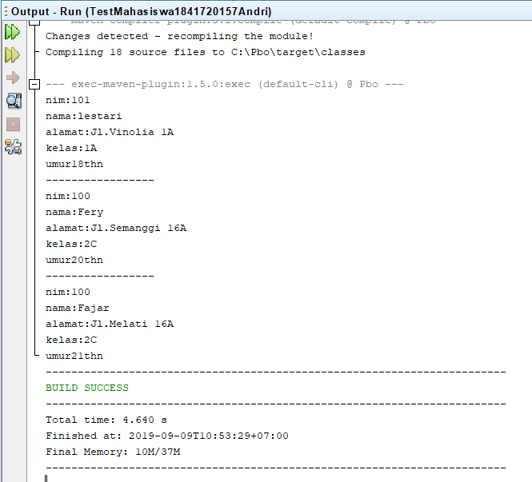

### Percobaan 3

( Menulis method yang memiliki argument/parameter dan memiliki return)

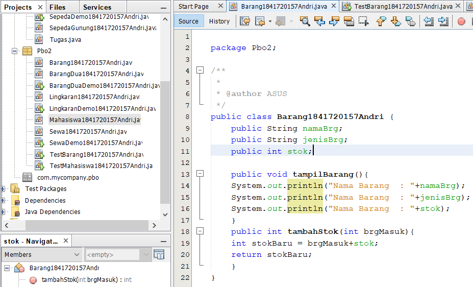
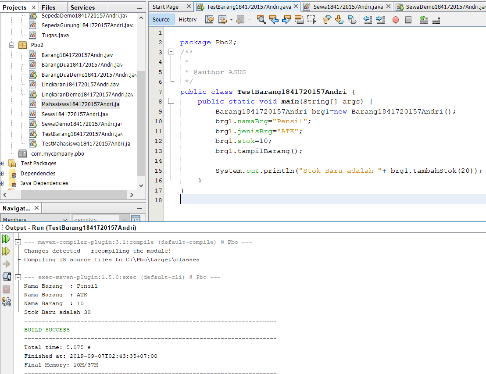

Contoh link kode program : [Program 1](../../src/2_Class_dan_Object/Barang1841720157Andri.java)
Contoh link kode program : [Program 2](../../src/2_Class_dan_Object/TestBarang1841720157Andri.java)

soal
7. Apakah fungsi argumen dalam suatu method?
8. Ambil kesimpulan tentang kegunaan dari kata kunci return , dan kapan suatu method harus memiliki return!

jawab

7.membri nilai yang harus di eksekusi dalam method tersebut

8. Return di gunakan untuk tipe data int untuk mengembalikan data int

## Tugas
 
    (silakan kerjakan tugas di sini beserta `screenshot` hasil kompilasi program. Jika ada rujukan ke file program, bisa dibuat linknya di sini.)

1. 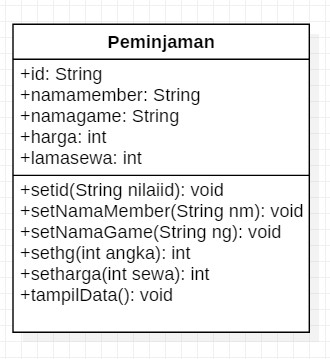

2. 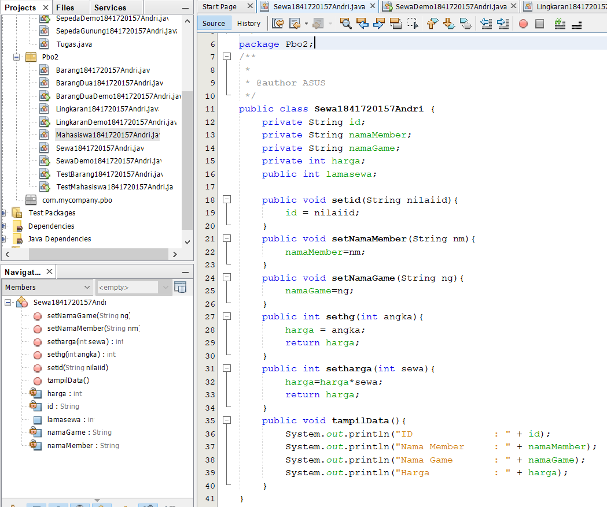
   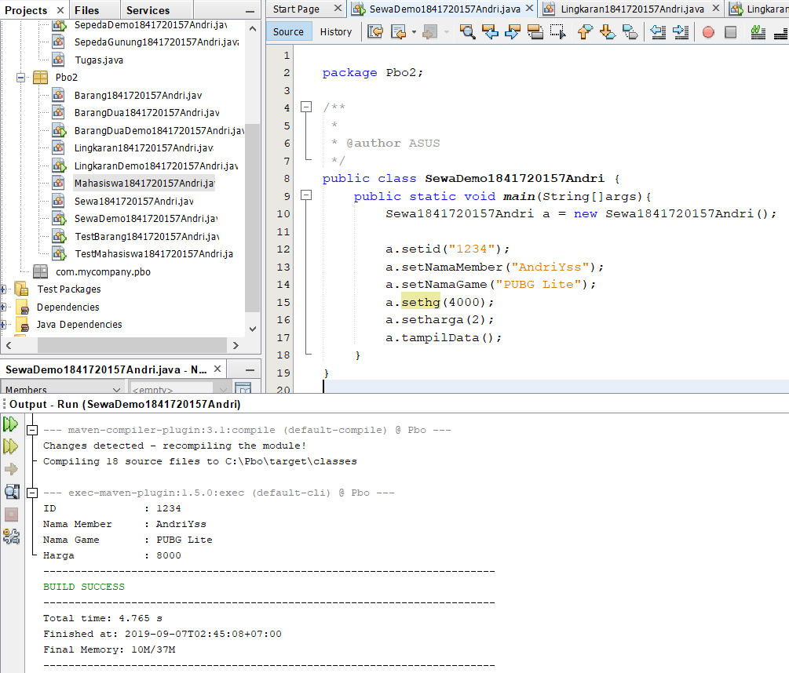

Contoh link kode program : [Program 1](../../src/2_Class_dan_Object/Sewa1841720157Andri.java)
Contoh link kode program : [Program 2](../../src/2_Class_dan_Object/SewaDemo1841720157Andri.java)

3. 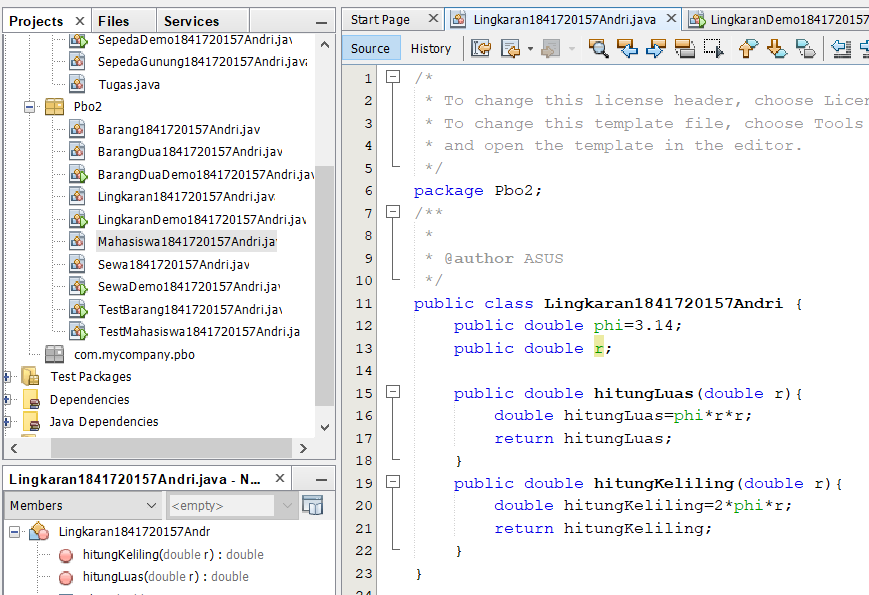
   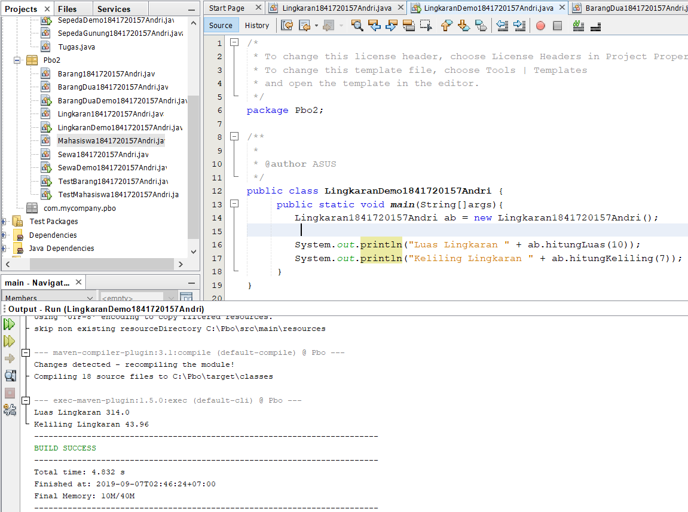

Contoh link kode program : [Program 1](../../src/2_Class_dan_Object/Sewa1841720157Andri.java)
Contoh link kode program : [Program 2](../../src/2_Class_dan_Object/SewaDemo1841720157Andri.java)

4. 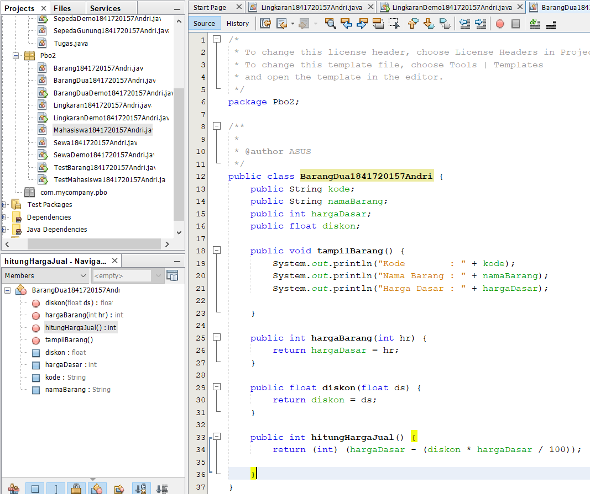
   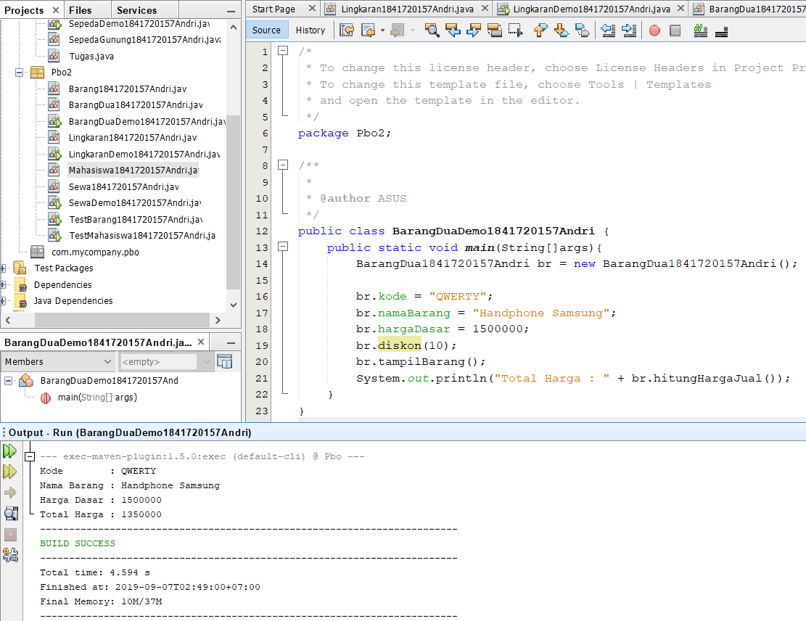

Contoh link kode program : [Program 1](../../src/2_Class_dan_Object/BarangDua1841720157Andri.java)
Contoh link kode program : [Program 2](../../src/2_Class_dan_Object/BarangDuaDemo1841720157Andri.java)

## Kesimpulan

•	di dalam deklarasi atribut perlu  di perhatikan acces modifier untuk membatasi resource mana saja yang dapat di akses oleh object tertentu.
proses pembuatan object dari suatu class di sebut instansiasi dengan di tandai kata kunci new. class diagram untuk menampilkan atribut beserta tipe datanya dan method yang di gunakan dalam suatu class

## Pernyataan Diri

Saya menyatakan isi tugas, kode program, dan laporan praktikum ini dibuat oleh saya sendiri. Saya tidak melakukan plagiasi, kecurangan, menyalin/menggandakan milik orang lain.

Jika saya melakukan plagiasi, kecurangan, atau melanggar hak kekayaan intelektual, saya siap untuk mendapat sanksi atau hukuman sesuai peraturan perundang-undangan yang berlaku.

Ttd,

***(ANDRI YOGA SUSILA)***