# Laporan Praktikum #4 - Relasi Kelas
## Kompetensi

1. Memahami konsep relasi kelas;
2. Mengimplementasikan relasi has‑a dalam program. 

## Ringkasan Materi

untuk keseluruhan dalam menyelesaikan tugas yang di berikan dosen tidak ada masalah, mulai terbiasa dengan cara pengiriman 

## Percobaan

### Percobaan 1

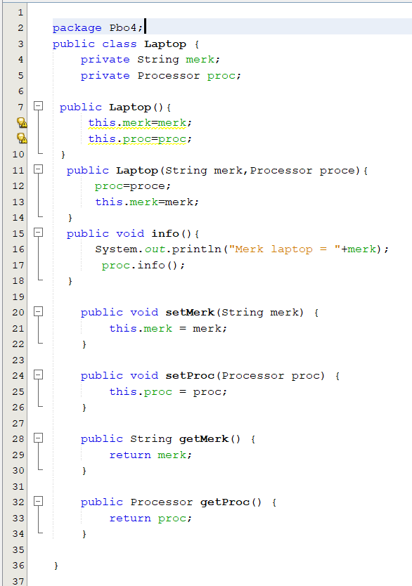
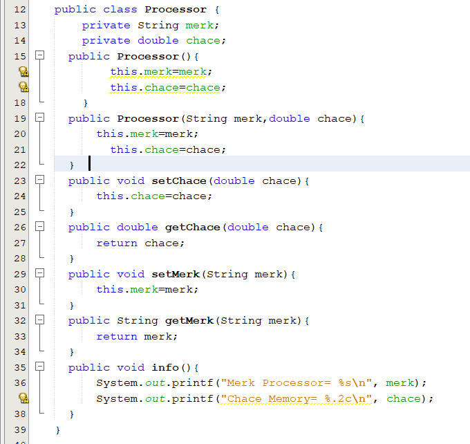
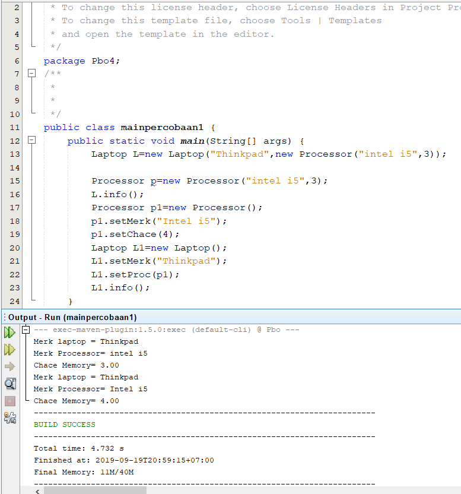

link kode program : [Program 1](../../src/4_Relasi_Class/Laptop.java)
link kode program : [Program 2](../../src/4_Relasi_Class/Processor.java)
link kode program : [Program 3](../../src/4_Relasi_Class/mainpercobaan1.java)

### Pertanyaan 

   Soal

1. Di dalam class Processor dan class Laptop , terdapat method setter dan getter untuk
masing‑masing atributnya. Apakah gunanya method setter dan getter tersebut ?
2. Di dalam class Processor dan class Laptop, masing‑masing terdapat konstruktor
default dan konstruktor berparameter. Bagaimanakah beda penggunaan dari kedua jenis
konstruktor tersebut ?Page 4 of 10
3. Perhatikan class Laptop, di antara 2 atribut yang dimiliki (merk dan proc), atribut
manakah yang bertipe object ?
4. Perhatikan class Laptop, pada baris manakah yang menunjukan bahwa class Laptop
memiliki relasi dengan class Processor ?
5. Perhatikan pada class Laptop , Apakah guna dari sintaks proc.info() ?
6. Pada class MainPercobaan1, terdapat baris kode:
Laptop l = new Laptop("Thinkpad", p);.
Apakah p tersebut ?
Dan apakah yang terjadi jika baris kode tersebut diubah menjadi:
Laptop l = new Laptop("Thinkpad", new Processor("Intel i5",
3));
Bagaimanakah hasil program saat dijalankan, apakah ada perubahan ?

Jawab

1. fungsinya sesuai dengan namanya yaitu untu menge-set (memberi nilai) dan menge-get (mendapatkan/melihat nilai) pada suatu variabel atau class dengan contructor default
2. bila konstruktor default, untuk memberi nilai menggunakan setter, tetapi jika kita menggunakan konstruktor berparameter, kita hanya perlu memberi nilai di parameter pada objek di class main
3. proc, karena inisiasi tipe variabel ditandai dengan nama object
4. Terlihat jelas pada constructor, terdapat parameter yang menggunakan object Processor yang telah diinisiasi sebelumnya.

5. proc.Info(), merupakan syntax yang digunakan untuk menjalankan method Info() pada class Processor
6. p merupakan object dari class Processor yang tadi telah diinstansiasi, Lalu kode program yang baru hasilnya sama saja, kode program tersebut memiliki perbedaan pada instansiasi dalam bentuk variabel object, bila pada kode program tersebut object tidak perlu diinstansiasi kedalam variabel lain tetapi ter nested atau bisa dibilang melakukan instansiasi objek dialam instansiasi object

### Percobaan 2

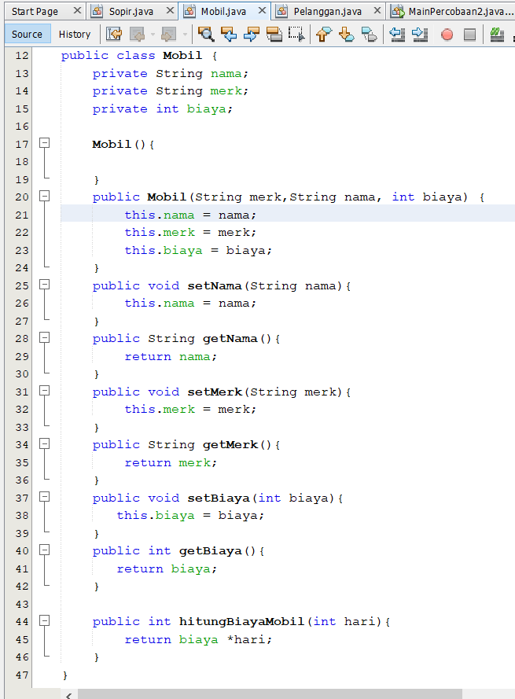
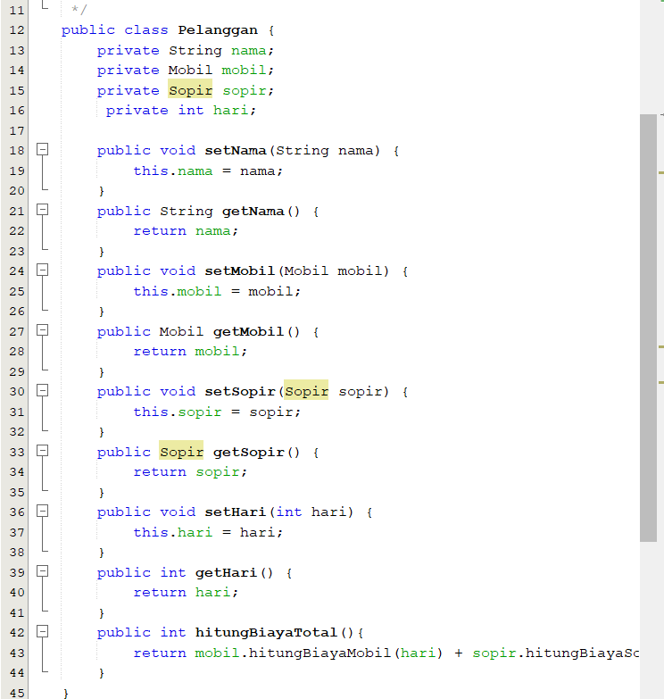
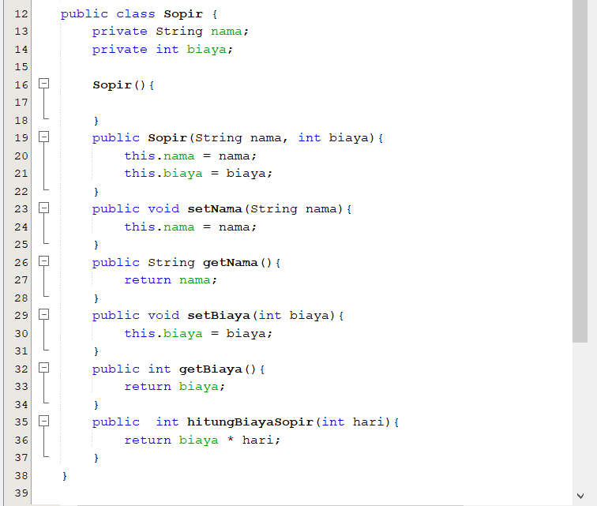
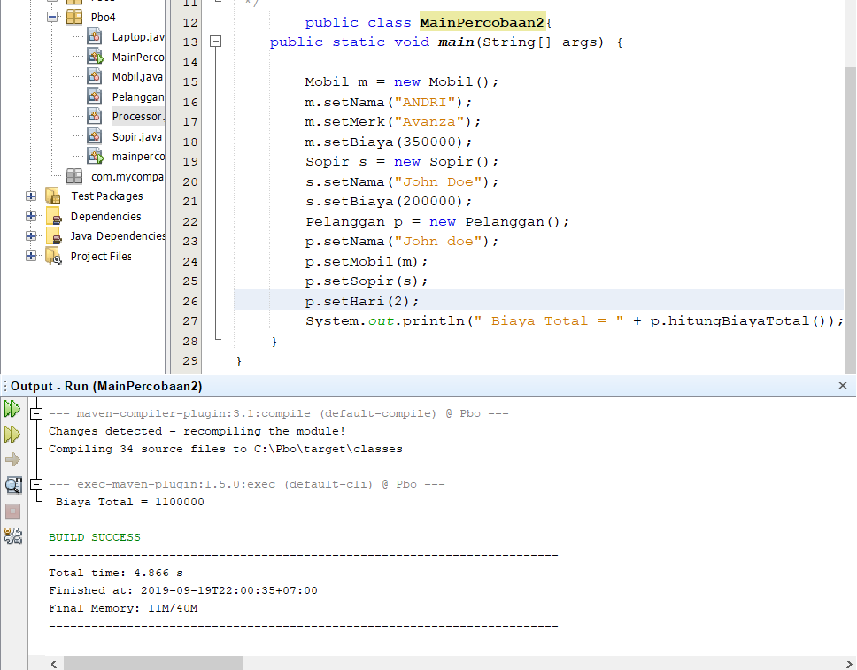

link kode program : [Program 1](../../src/4_Relasi_Class/Mobil.java)
link kode program : [Program 2](../../src/4_Relasi_Class/Pelanggan.java)
link kode program : [Program 3](../../src/4_Relasi_Class/Sopir.java)
link kode program : [Program 4](../../src/4_Relasi_Class/MainPercobaan2.java)

 Soal

1. Perhatikan class Pelanggan. Pada baris program manakah yang menunjukan bahwa class
Pelanggan memiliki relasi dengan class Mobil dan class Sopir ?
2. Perhatikan method hitungBiayaSopir pada class Sopir, serta method
hitungBiayaMobil pada class Mobil. Mengapa menurut Anda method tersebut harus
memiliki argument hari ?Page 6 of 10
3. Perhatikan kode dari class Pelanggan. Untuk apakah perintah
mobil.hitungBiayaMobil(hari) dan sopir.hitungBiayaSopir(hari) ?
4. Perhatikan class MainPercobaan2. Untuk apakah sintaks p.setMobil(m) dan
p.setSopir(s) ?
5. Perhatikan class MainPercobaan2. Untuk apakah proses p.hitungBiayaTotal()
tersebut ?
6. Perhatikan class MainPercobaan2, coba tambahkan pada baris terakhir dari method
main dan amati perubahan saat di‑run!
System.out.println(p.getMobil().getMerk());

  Jawab
1. public class Pelanggan {
    private String nama;
    private Mobil mobil;
    private Sopir sopir;
    private int hari;
2. argumen tersebut nantinya digunakan untuk diisi dengan variabel int hari pada class Pelanggan
3. kode program tersebut digunakan untuk menjumlahkan biaya mobil yang diambil dari harga sopir dikali dengan hari lalu yang dijumlahkan dengan biaya sopir yang diambil dari harga sopir dikali hari
4. kode program tersebut digunakan untuk memberi atau mengisi nilai dari namaMobil dan namaSopir yang ada pada objek pelanggan
5. Digunakan untuk menghitung biaya total dari penjumlahan antara biaya sopir dan biaya mobil
6. perintah tersebut digunakan untuk menggembalikan atau me return nilai atribut dari method  getMerk() pada class Mobil melalui objek pelanggan, atau setelah me return object Mobil pada class pelanggan, object mobil akan me return String getMerk() pada class mobil

### Percobaan 3

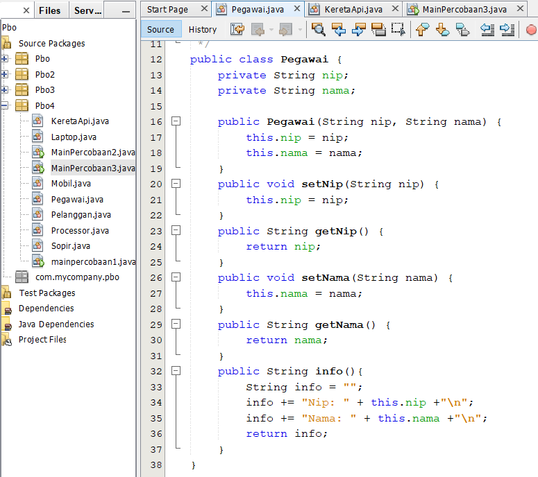
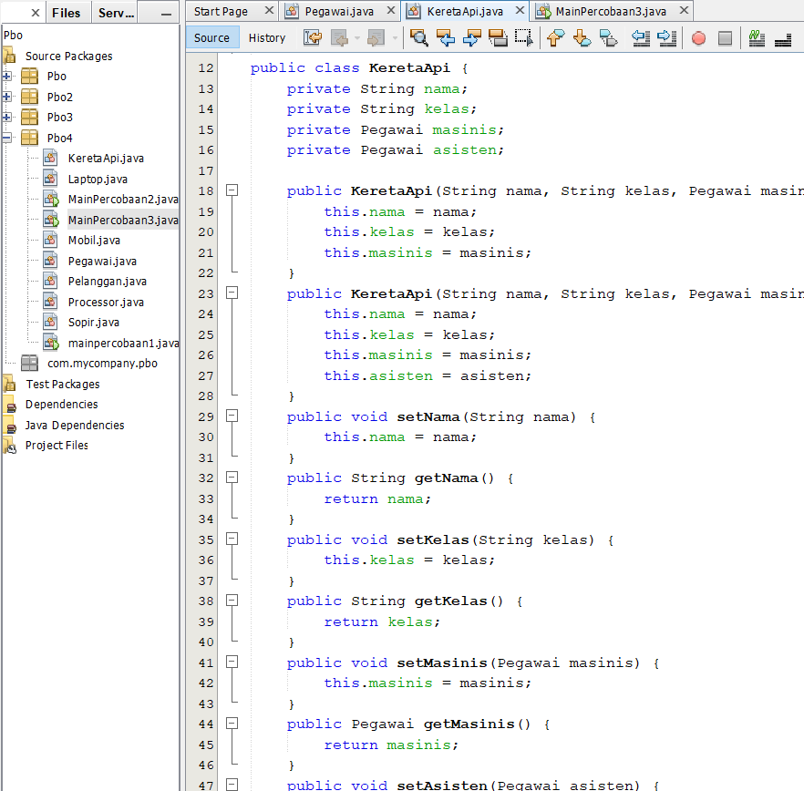
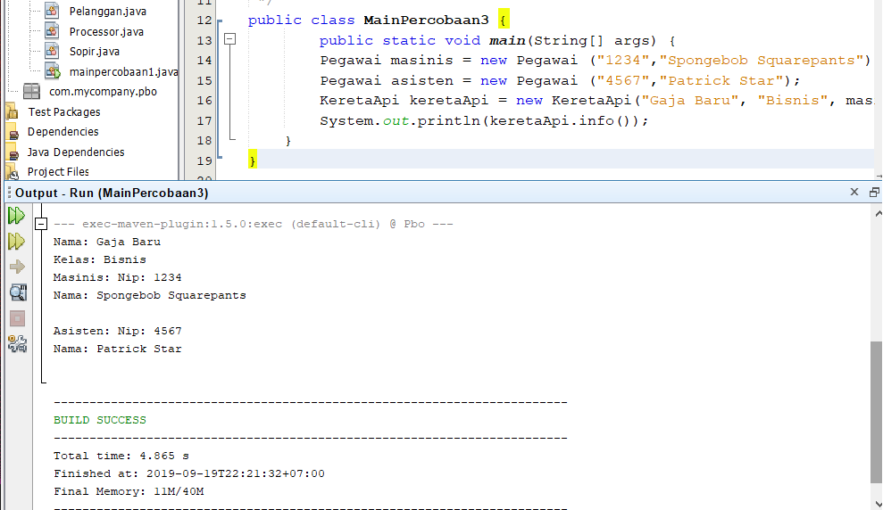

link kode program : [Program 1](../../src/4_Relasi_Class/Pegawai.java)
link kode program : [Program 2](../../src/4_Relasi_Class/KeretaApi.java)
link kode program : [Program 3](../../src/4_Relasi_Class/MainPercobaan3.java)

### Pertanyaan

 Soal

1. Di dalam method info() pada class KeretaApi, baris this.masinis.info() dan
this.asisten.info() digunakan untuk apa ?
2. Buatlah main program baru dengan nama class MainPertanyaan pada package yang
sama. Tambahkan kode berikut pada method main() !
Pegawai masinis = new Pegawai("1234", "Spongebob
Squarepants");
KeretaApi keretaApi = new KeretaApi("Gaya Baru", "Bisnis",
masinis);
System.out.println(keretaApi.info());
3. Apa hasil output dari main program tersebut ? Mengapa hal tersebut dapat terjadi ?
4. Perbaiki class KeretaApi sehingga program dapat berjalan !

Jawab

1. digunakan untuk memanggil method Info yang berada di class Pegawai melalui object masinis dan asisten
2. 
3. 
karane ada variabel yang tidak bernilai atau disebut dengan null, dan variabel tersebut adalah object asisten pada class KeretaApi
4. 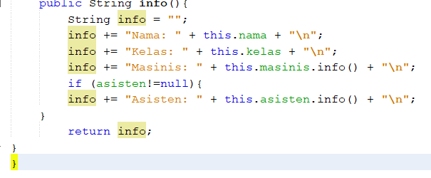
   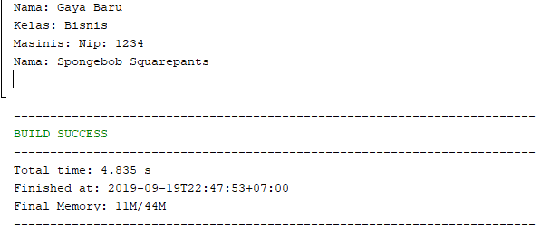

### Percobaan 4

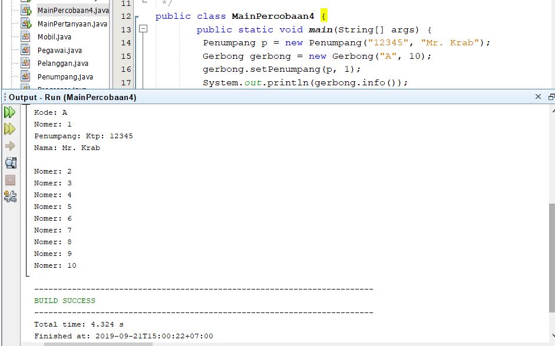

link kode program : [Program 1](../../src/4_Relasi_Class/Penumpang.java)
link kode program : [Program 2](../../src/4_Relasi_Class/Kursi.java)
link kode program : [Program 3](../../src/4_Relasi_Class/Gerbong.java)
link kode program : [Program 4](../../src/4_Relasi_Class/MainPercobaan4.java)

### Pertanyaan

Soal

1. Pada main program dalam class MainPercobaan4, berapakah jumlah kursi dalam
Gerbong A ?
2. Perhatikan potongan kode pada method info() dalam class Kursi. Apa maksud kode
tersebut ?
...
if (this.penumpang != null) {
info += "Penumpang: " + penumpang.info() + "\n";
}
...
3. Mengapa pada method setPenumpang() dalam class Gerbong, nilai nomor dikurangi
dengan angka 1 ?
4. Instansiasi objek baru budi dengan tipe Penumpang, kemudian masukkan objek baru
tersebut pada gerbong dengan gerbong.setPenumpang(budi, 1). Apakah yang
terjadi ?
5. Modifikasi program sehingga tidak diperkenankan untuk menduduki kursi yang sudah ada
penumpang lain !

Jawab

1. 10, dapat dilihat pada instansiasi new Gerbong atau pada output bisa dilihat perulangan “Nomer : 10” 

2. potongan kode program tersebut digunakan untuk menampilkan kursi yang terisi oleh penumpang, tetapi bila penumpang tidak bernilai atau null, maka kode program yang terdapat pada if tidak dijalankan atau berarti kursi tersebut masih kosong

3. karena index array selalu dimulai dari 0, oleh karena itu nilai nomer harus dikurangi 1 agar array di index 0 atau di index pertama dapat terisi

4. 
   

5. 
   
  

## Tugas
 
1.  Diagram
    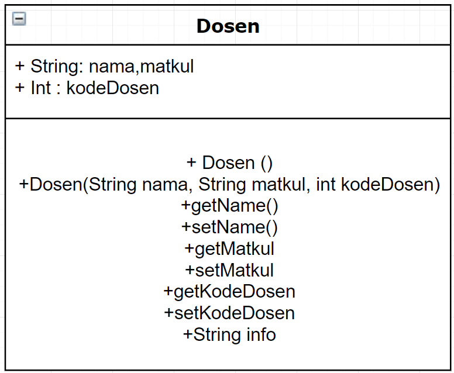
    
    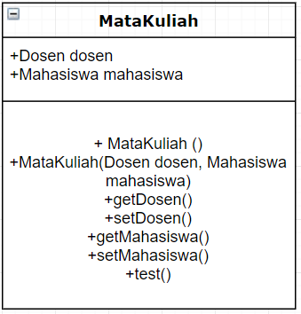
    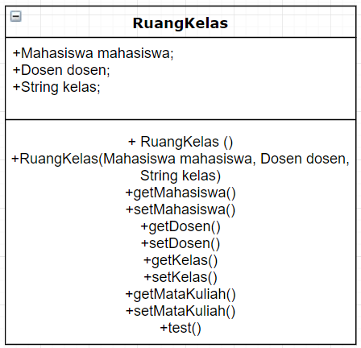

program

  
  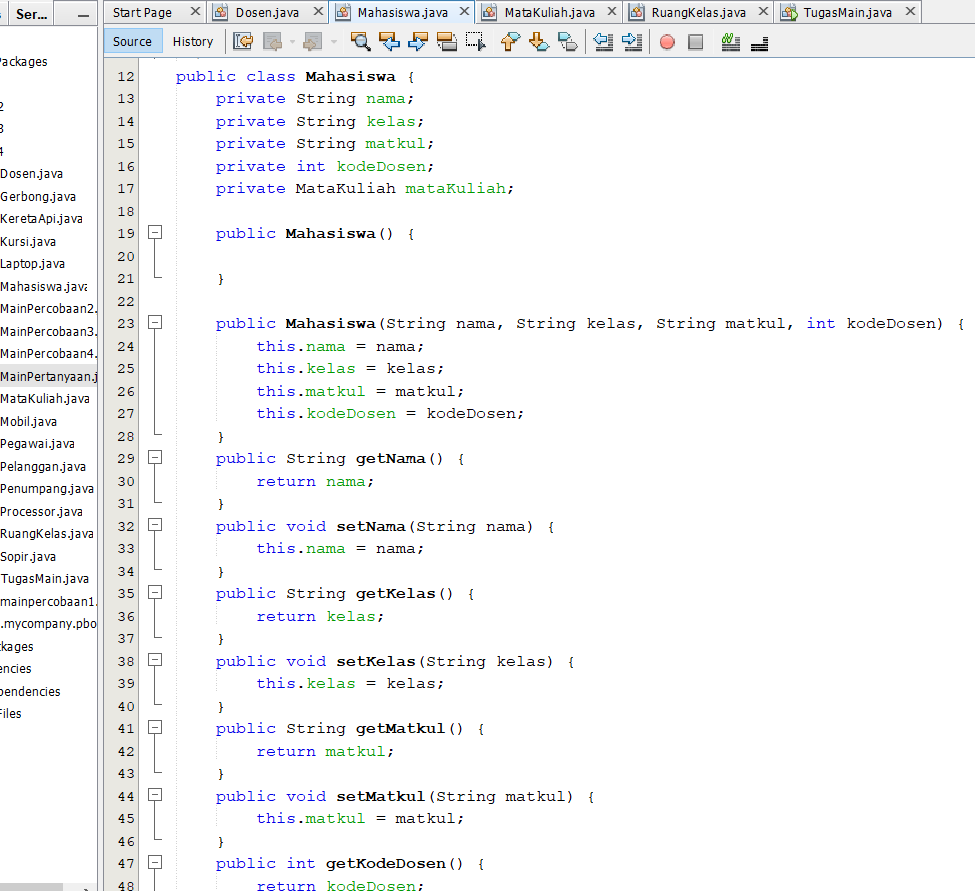
  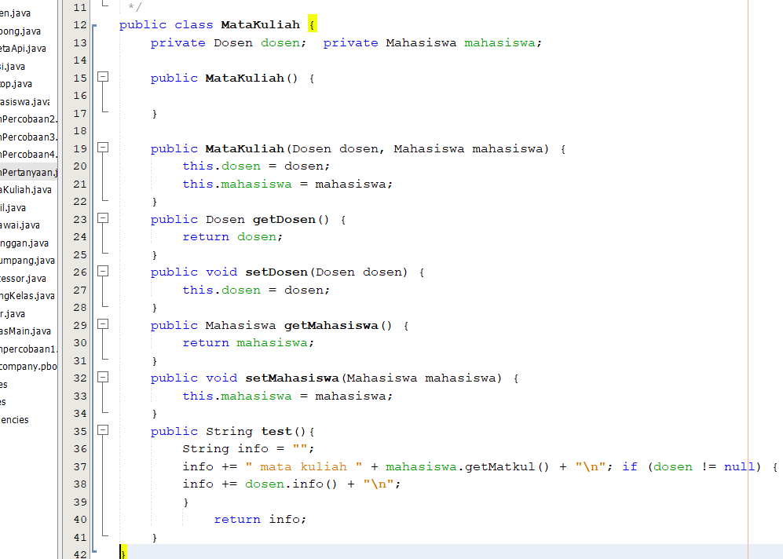
  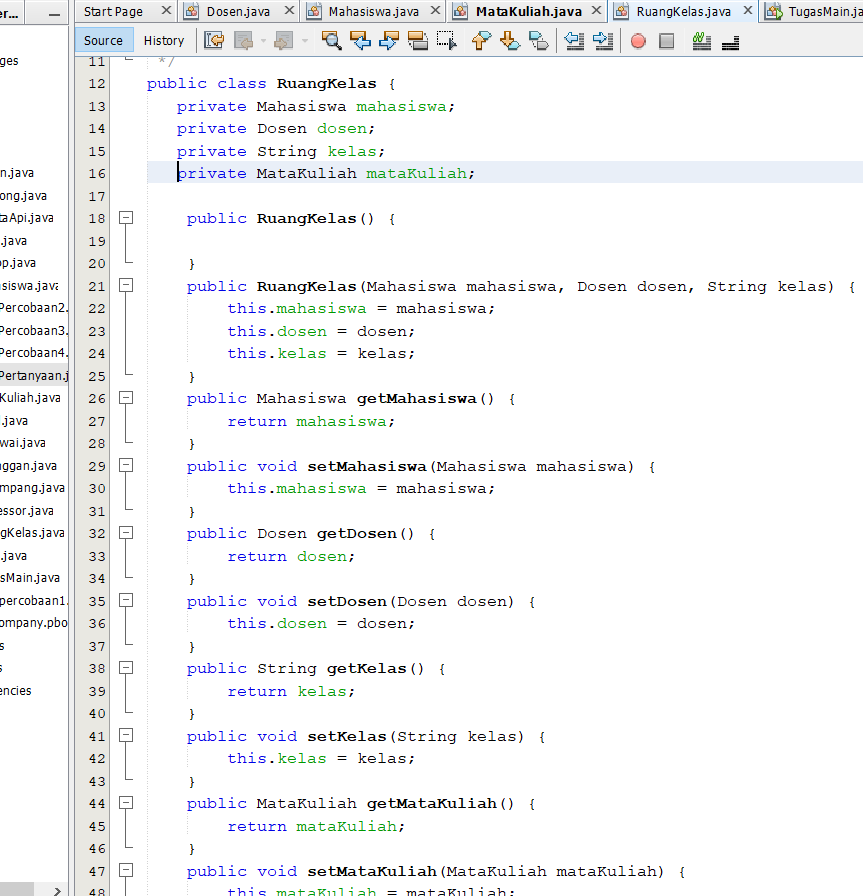
  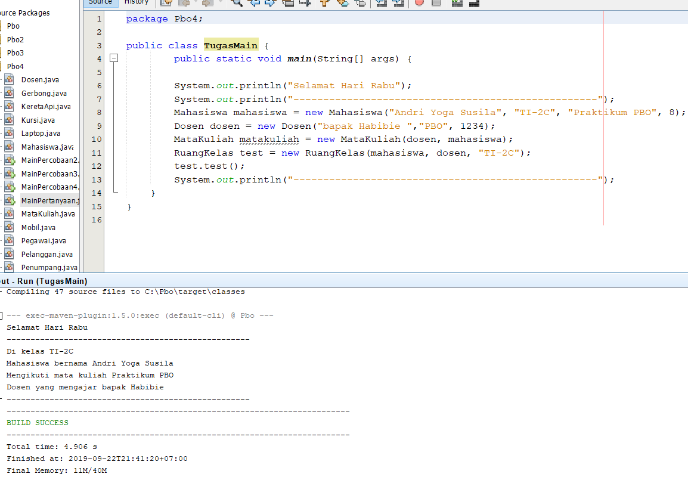

link kode program : [Program 1](../../src/4_Relasi_Class/Dosen.java)

link kode program : [Program 2](../../src/4_Relasi_Class/Mahasiswa.java)

link kode program : [Program 3](../../src/4_Relasi_Class/MataKuliah.java)

link kode program : [Program 4](../../src/4_Relasi_Class/RuangKelas.java)

link kode program : [Program 5](../../src/4_Relasi_Class/TugasMain.java)

## Kesimpulan

Pada kasus yang lebih kompleks, dalam suatu sistem akan ditemukan lebih dari satu class yang saling memiliki keterkaitan antara class satu dengan yang lain. Pada percobaan‑percobaan sebelumnya, mayoritas kasus yang sudah dikerjakan hanya fokus pada satu class saja. Pada jobsheet ini akan dilakukan percobaan yang melibatkan beberapa class yang saling berelasi.

## Pernyataan Diri

Saya menyatakan isi tugas, kode program, dan laporan praktikum ini dibuat oleh saya sendiri. Saya tidak melakukan plagiasi, kecurangan, menyalin/menggandakan milik orang lain.

Jika saya melakukan plagiasi, kecurangan, atau melanggar hak kekayaan intelektual, saya siap untuk mendapat sanksi atau hukuman sesuai peraturan perundang-undangan yang berlaku.

Ttd,

***(ANDRI YOGA SUSILA)***