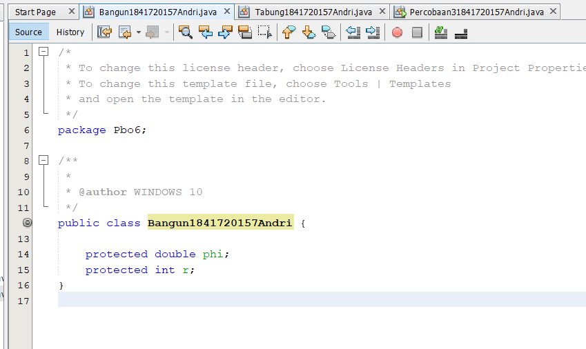
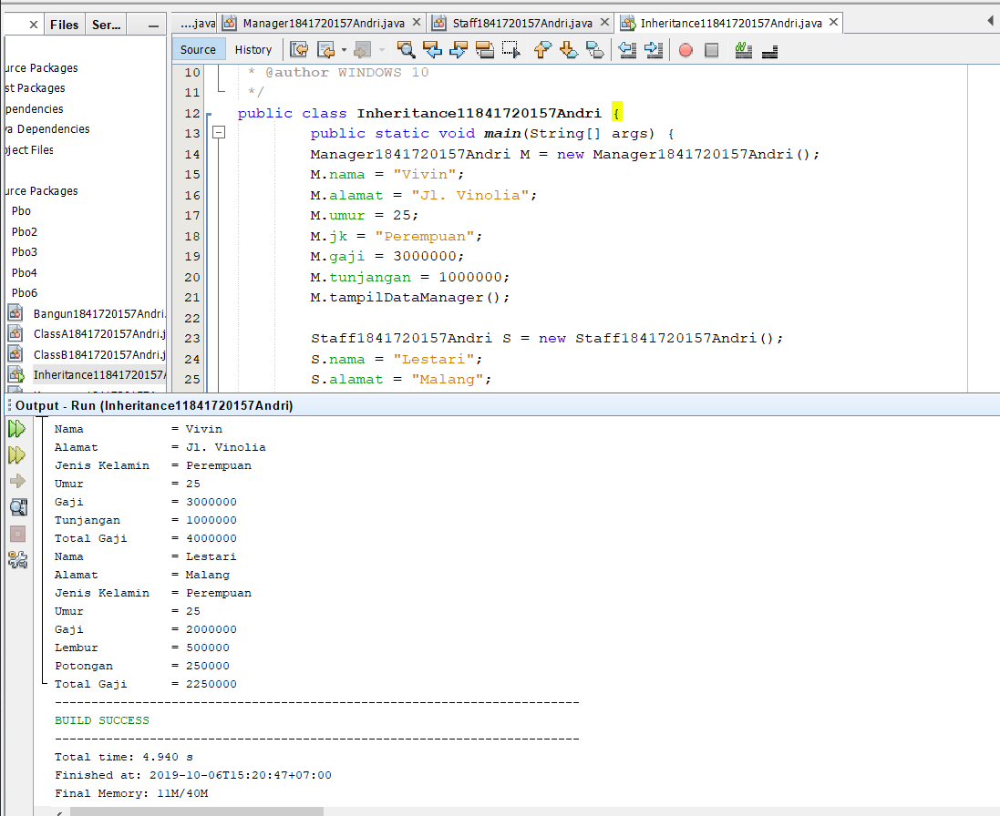
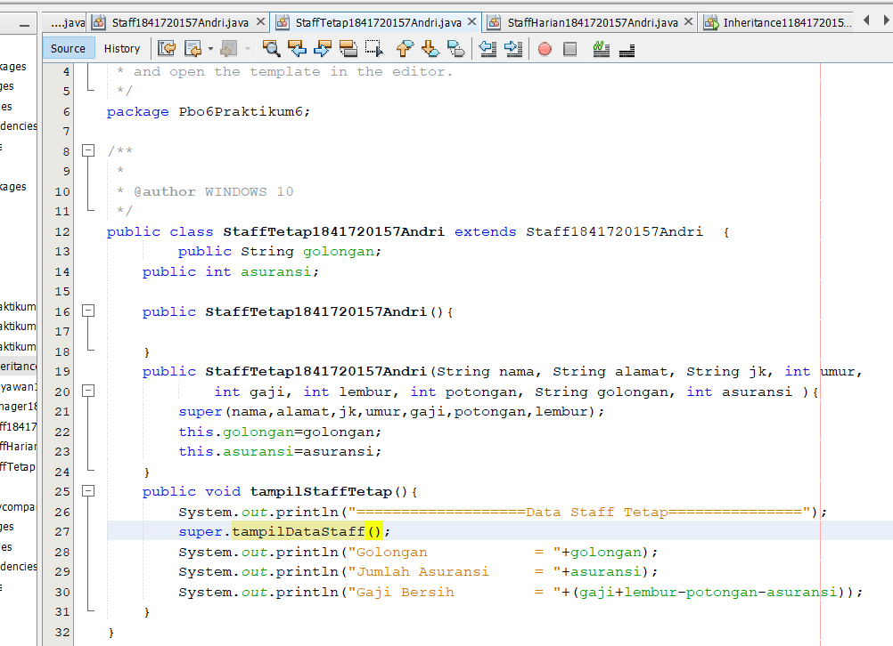
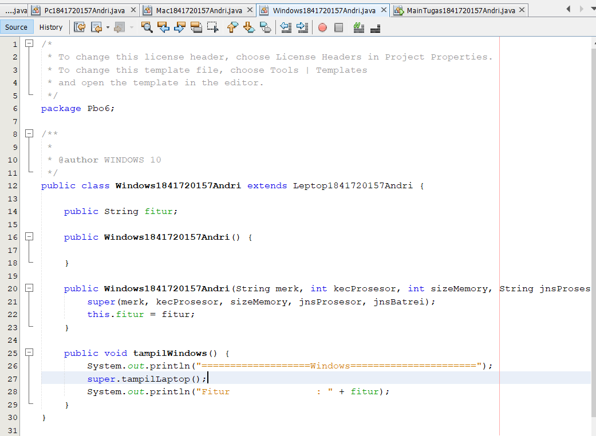

# Laporan Praktikum #4 - Relasi Kelas
## Kompetensi

1. Memahami	konsep	dasar	inheritance	atau	pewarisan.
2. Mampu	membuat	suatu	subclass	dari	suatu	superclass	tertentu.
3. Mampu	mengimplementasikan	konsep	single	dan	multilevel	inheritance.
4. Mampu	membuat	objek	dari	suatu	subclass	dan	melakukan	pengaksesan	terhadap	atribut	
dan	method	baik	yang	dimiliki	sendiri	atau	turunan	dari	superclass	nya.

## Ringkasan Materi

untuk keseluruhan dalam menyelesaikan tugas yang di berikan dosen tidak ada masalah, mulai terbiasa dengan cara pengiriman 

## Percobaan

### Percobaan 1

link kode program : [Program 1](../../src/6_Inheritance/ClassA1841720157Andri.java)
link kode program : [Program 1](../../src/6_Inheritance/ClassB1841720157Andri.java)
link kode program : [Program 1](../../src/6_Inheritance/Percobaan11841720157Andri.java)

### Pertanyaan 

   Soal

1. Pada	percobaan	1	diatas	program	yang	dijalankan	terjadi	error,	kemudian	perbaiki	sehingga	
program	tersebut	bisa	dijalankan	dan	tidak	error!
2. Jelaskan	apa	penyebab	program pada	percobaan	1	ketika	dijalankan	terdapat	error!

Jawab

1. 
 
2. terjadi error karena tidak di deklarasikan z,y serta pada classB tidak di tambah i extends

### Percobaan 2

link kode program : [Program 1](../../src/6_Inheritance/praktikum2/ClassA1841720157Andri.java)
link kode program : [Program 2](../../src/6_Inheritance/praktikum2/ClassB1841720157Andri.java)
link kode program : [Program 3](../../src/6_Inheritance/praktikum2/Percobaan21841720157Andri.java)

 Soal

1. Pada	percobaan	2 diatas	program	yang	dijalankan	terjadi	error,	kemudian	perbaiki	sehingga	
program	tersebut	bisa	dijalankan	dan	tidak	error!
2. Jelaskan	apa	penyebab	program	pada	percobaan	1	ketika	dijalankan	terdapat	error!

  Jawab
1.   
2. Karena pada ClassB tidak di tambah i 
    

### Percobaan 3

link kode program : [Program 1](../../src/6_Inheritance/Bangun1841720157Andri.java)
link kode program : [Program 2](../../src/6_Inheritance/Tabung1841720157Andri.java)
link kode program : [Program 3](../../src/6_Inheritance/Percobaan31841720157Andri.java)

### Pertanyaan

 Soal
1. Jelaskan	fungsi	 “super”	pada	potongan	program	berikut	di	class	Tabung!
2. Jelaskan	fungsi	“super”	dan	“this”	pada	potongan	program	berikut	di	class	Tabung!
3. Jelaskan	mengapa	pada	class	Tabung	tidak	dideklarasikan	atribut	“phi”	dan	“r”	tetapi	class	
tersebut	dapat	mengakses	atribut	tersebut!

Jawab

1. Untuk mempresentasikan object dari class induk
2. Fungsinya untuk mengambil nilai dari kelas induk , sedangkan This untuk mempresentasikan object class itu sendiri 
3. Karena kelas tabung mengambil nilai object dari kelas Bangun

### Percobaan 4

link kode program : [Program 1](../../src/6_Inheritance/praktikum4/ClassA1841720157Andri.java)
link kode program : [Program 2](../../src/6_Inheritance/praktikum4/ClassB1841720157Andri.java)
link kode program : [Program 3](../../src/6_Inheritance/praktikum4/ClassC1841720157Andri.java)
link kode program : [Program 4](../../src/6_Inheritance/praktikum4/Percobaan41841720157Andri.java)

### Pertanyaan

Soal
1. Pada	percobaan	4	sebutkan	mana	class	yang	termasuk	superclass	dan	subclass,	kemudian	
jelaskan	alasannya!
2. Ubahlah	isi	konstruktor	default	ClassC	seperti	berikut:Tambahkan	kata	super()	di	baris	Pertaman	dalam	konstruktor	defaultnya.	Coba	jalankan	
kembali	class	Percobaan4	dan	terlihat	tidak	ada	perbedaan	dari	hasil	outputnya!
3. Ublah	isi	konstruktor	default	ClassC	seperti	berikut:
Ketika	mengubah	posisi	super()	dibaris	kedua	dalam	kontruktor	defaultnya	dan	terlihat	ada	
error.	Kemudian	kembalikan	super()	kebaris	pertama	seperti	sebelumnya,	maka	errornya	
akan	hilang.
Perhatikan	hasil	keluaran	ketika	class	Percobaan4	dijalankan.	Kenapa	bisa	tampil	output	
seperti	berikut	pada	saat	instansiasi	objek	test	dari	class	ClassC
Jelaskan	bagaimana	urutan	proses	jalannya	konstruktor	saat	objek	test	dibuat!
4. Apakah	fungsi	super()	pada	potongan	program	dibawah	ini	di	ClassC!

### Jawab 
1. Super Class Adalah ClassA 
SubClass nya : ClassB , ClassC 
Karena pada ClassB dan ClassC kita ketikkan Extends untuk mempresentasikan nilai dari induk Class
2.  
3. Urutan konstrakter di awal i dari ClassA (superclass) isi dari Classa di tampilkan kemudian ClassB yang mana Di mana kita tambahkan Extends untuk memanggil fungsi dari kelas lain isi dari ClassB di tampilkan , kemudian pada ClassC di ulangi seperti yang ada di ClassC dan isi dari ClassC di tampilkan atau di jalakankan . yang mana pada Percobaan4(main) di panggil dengan 
+ public static void main(String[] args) {
        ClassC1841720157Andri test = new ClassC1841720157Andri(); 
4. dapat digunakan untuk memanggil method ternetu dari kelas induk

### Percobaan 5

link kode program : [Program 1](../../src/6_Inheritance/Karyawan1841720157Andri.java)
link kode program : [Program 2](../../src/6_Inheritance/Manager1841720157Andri.java)
link kode program : [Program 3](../../src/6_Inheritance/Staff1841720157Andri.java)
link kode program : [Program 4](../../src/6_Inheritance/inheritance11841720157Andri.java)

### Pertanyan
Soal
1. Sebutkan	class	mana	yang	termasuk	super	class	dan	sub	class	dari	percobaan	1	diatas!
2. Kata	kunci	apakah	yang	digunakan	untuk	menurunkan	suatu	class	ke	class	yang	lain?
3. Perhatikan	kode	program	pada	class	Manager,	atribut	apa	saja	yang	dimiliki	oleh	class	
tersebut?	Sebutkan	atribut	mana	saja	yang	diwarisi	dari	class	Karyawan!
4. Jelaskan	kata	kunci	super	pada	potongan	program	dibawah	ini	yang	terdapat	pada	class	
Manager!
5. Program	pada	percobaan	1	diatas	termasuk	dalam	jenis	inheritance	apa?	Jelaskan	
alasannya!

Jawab:
1. Super Class (Karyawan) sedangkan sub Class (Staff, Manager) dengan mengetikkan extends pada classnya dan di ikut i super classnya Karyawan
2. Yaitu dengan menggunakan Extends untuk menurunkan ke Class yang lainnya
3. Pada ClassManager terdapat attribut : int Tunjagan 
Attribut pada class Kariyawan : Gaji , yang mana nanti akan di turunkan menjadi Tunjagan pada Class Manager
4. Mewakil i dari kelas induknya yaitu Gaji , sedangkan tunjagan mewakil i kelas Manager 
5. Multilevel Inheritance: Suatu sub class yang menjadi parent class untuk class lainnya.

### Percobaan 6

link kode program : [Program 1](../../src/6_Inheritance/praktikum6/Karyawan1841720157Andri.java)
link kode program : [Program 2](../../src/6_Inheritance/praktikum6/Manager1841720157Andri.java)
link kode program : [Program 3](../../src/6_Inheritance/praktikum6/Staff1841720157Andri.java)
link kode program : [Program 4](../../src/6_Inheritance/praktikum6/StaffTetap1841720157Andri.java)
link kode program : [Program 5](../../src/6_Inheritance/praktikum6/StaffHarian1841720157Andri.java)
link kode program : [Program 6](../../src/6_Inheritance/praktikum6/inheritance11841720157Andri.java)

### Pertanyan
Soal:
1. Berdasarkan	class	diatas	manakah	yang	termasuk	single	inheritance	dan	mana	yang	
termasuk	multilevel	inheritance?
2. Perhatikan	kode	program	class	StaffTetap	dan	StaffHarian,	atribut	apa	saja	yang	dimiliki	oleh	
class	tersebut?	Sebutkan	atribut	mana	saja	yang	diwarisi	dari	class	Staff!
3. Apakah	fungsi	potongan	program	berikut	pada	class	StaffHarian
4. Apakah	fungsi	potongan	program	berikut	pada	class	StaffHarian
5. Perhatikan	kode	program	dibawah	ini	yang	terdapat	pada	class	StaffTetap
Terlihat	dipotongan	program	diatas	atribut	gaji,	lembur	dan	potongan	dapat	diakses	
langsung.	Kenapa	hal	ini	bisa	terjadi	dan	bagaimana	class	StaffTetap	memiliki	atribut	gaji,	
lembur,	dan	potongan	padahal	dalam	class	tersebut	tidak	dideklarasikan	atribut	gaji,	lembur,	
dan	potongan?

Jawab:
1. Single Inheritance : Pada Percobaan 1 ClassA (Class B mewakili Class B , Class Tabung mewakili Class Tabung)
Multilavel inheritance : pada Percobaan4 (Class B,C mewakili Class A, Class Manager, Staff mewakili Class Karyawan, Staffharian, Stafftetap mewakili Class Staff) 
2. Attribut Class StaffHarian = jumlah jam kerja yang mana attribut ini diwarisi oleh class karyawan (potongan)
Attribut Class StaffTetap = golongan , asuransi yang mana attribut ini diwarisi oleh class karyawan (lembur)
3. untuk memanggil nilai dari dari variabel yang ada di dalam class induk (super class)
4. Karena pada method tampilDatastaff(); menggunakan kata kunci super untuk mengambil nilai dari variable yang ada di jalam sub class
5. Karena pada class StaffTetap kita menggunakan extands untuk memanggil isi yang terdapat di dalam Class Staf yang mana isinya atribut gaji, lembur, dan potongan

### TUGAS

link kode program : [Program 1](../../src/6_Inheritance/Komputer1841720157Andri.java)
link kode program : [Program 2](../../src/6_Inheritance/Leptop1841720157Andri.java)
link kode program : [Program 3](../../src/6_Inheritance/Pc1841720157Andri.java)
link kode program : [Program 4](../../src/6_Inheritance/Mac1841720157Andri.java)
link kode program : [Program 5](../../src/6_Inheritance/Windows1841720157Andri.java)
link kode program : [Program 6](../../src/6_Inheritance/MainTugas1841720157Andri.java)

## Kesimpulan

Inheritance atau pewarisan sifat merupakan suatu cara untuk menurutnkan suatu class yagn lebih umum menjadi suatu class yang spesifik.

## Pernyataan Diri

Saya menyatakan isi tugas, kode program, dan laporan praktikum ini dibuat oleh saya sendiri. Saya tidak melakukan plagiasi, kecurangan, menyalin/menggandakan milik orang lain.

Jika saya melakukan plagiasi, kecurangan, atau melanggar hak kekayaan intelektual, saya siap untuk mendapat sanksi atau hukuman sesuai peraturan perundang-undangan yang berlaku.

Ttd,

***(ANDRI YOGA SUSILA)***