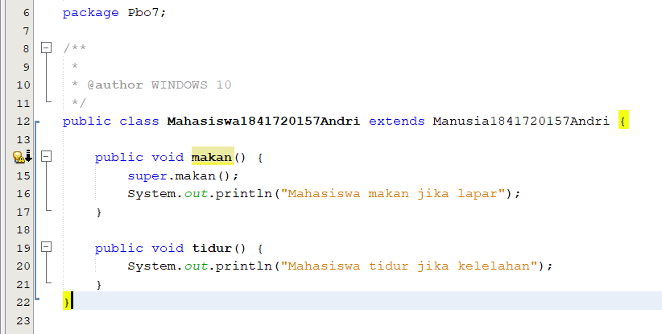

# Laporan Praktikum #7 - Overriding_dan_Overloading
## Kompetensi

1. Memahami konsep overloading dan overriding,
2. Memahami perbedaan overloading dan overriding,
3. Ketepatan dalam mengidentifikasi method overriding dan overloading
4. Ketepatan dalam mempraktekkan instruksi pada jobsheet
5. Mengimplementasikan method overloading dan overriding

## Ringkasan Materi

untuk keseluruhan dalam menyelesaikan tugas yang di berikan dosen tidak ada masalah, mulai terbiasa dengan cara pengiriman 

## Percobaan

### Percobaan 1

link kode program : [Program 1](../../src/7_Overriding_dan_Overloading/Karyawan1841720157Andri.java)
link kode program : [Program 2](../../src/7_Overriding_dan_Overloading/Staff1841720157Andri.java)
link kode program : [Program 3](../../src/7_Overriding_dan_Overloading/Manager1841720157Andri.java)
link kode program : [Program 4](../../src/7_Overriding_dan_Overloading/Utama1841720157Andri.java)

### 4.LATIHAN

Program jadi satu di bawah

### Pertanyaan
4.1 Dari source coding diatas terletak dimanakah overloading?

4.2 Jika terdapat overloading ada berapa jumlah parameter yang berbeda?

Jawab : Terdapat satu parameter berbeda yaitu int c
----------

4.3 Dari source coding diatas terletak dimanakah overloading?

4.4 Jika terdapat overloading ada berapa tipe parameter yang berbeda?

Jawab : Terdapat empat parameter berbeda yaitu int a, int b, double a, double b

link kode program : [Program](../../src/7_Overriding_dan_Overloading/Perkalianku1841720157Andri.java)

#### Ikan

#### Piranha

#### Fish

link kode program : [Program ikan](../../src/7_Overriding_dan_Overloading/ikan1841720157Andri.java)
link kode program : [Program Piranha](../../src/7_Overriding_dan_Overloading/Piranha1841720157Andri.java)
link kode program : [Program Fish](../../src/7_Overriding_dan_Overloading/Fish1841720157Andri.java)

#### Soal

4.5 Dari source coding diatas terletak dimanakah overriding?

4.6 Jabarkanlah apabila sourcoding diatas jika terdapat overriding?

Jawab : Deklarasi method pada subclass Piranha sama dengan method superclass Ikan

## TUGAS
    Overloading

link kode program : [Program 1](../../src/7_Overriding_dan_Overloading/Segitiga1841720157Andri.java)
link kode program : [Program 2](../../src/7_Overriding_dan_Overloading/MainSegitiga1841720157Andri.java)

    Overriding

link kode program : [Program 1](../../src/7_Overriding_dan_Overloading/Manusia1841720157Andri.java)
link kode program : [Program 2](../../src/7_Overriding_dan_Overloading/Dosen1841720157Andri.java)
link kode program : [Program 3](../../src/7_Overriding_dan_Overloading/Mahasiswa1841720157Andri.java)
link kode program : [Program 4](../../src/7_Overriding_dan_Overloading/Main1841720157Andri.java)

## Kesimpulan

1. Saya lebih memahami konsep overloading dan overriding
2. Saya lebih memahaami perbedaana overloading dan overriding
3. Saya lebih mampu mengimplementasikan method-method overloading dan
overriding

## Pernyataan Diri

Saya menyatakan isi tugas, kode program, dan laporan praktikum ini dibuat oleh saya sendiri. Saya tidak melakukan plagiasi, kecurangan, menyalin/menggandakan milik orang lain.

Jika saya melakukan plagiasi, kecurangan, atau melanggar hak kekayaan intelektual, saya siap untuk mendapat sanksi atau hukuman sesuai peraturan perundang-undangan yang berlaku.

Ttd,

***(ANDRI YOGA SUSILA)***