# Laporan Praktikum #9 Abstract_Class_dan_Interface

## Kompetensi

1. Menjelaskan maksud dan tujuan penggunaan Abstract Class;
2. Menjelaskan maksud dan tujuan penggunaan Interface;
3. Menerapkan Abstract Class dan Interface di dalam pembuatan program.

## Ringkasan Materi

untuk keseluruhan dalam menyelesaikan tugas yang di berikan dosen tidak ada masalah, mulai terbiasa dengan cara pengiriman 

## Percobaan

### Percobaan 1 (Abstract Class)

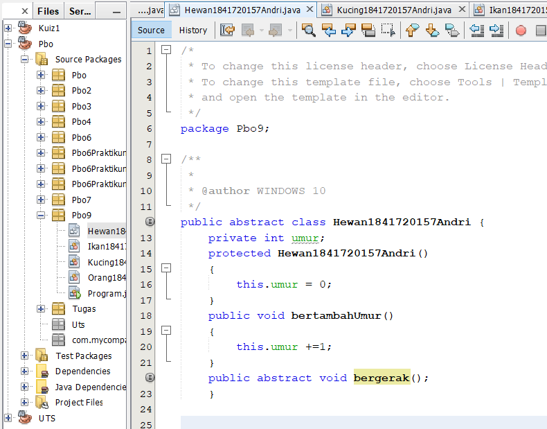
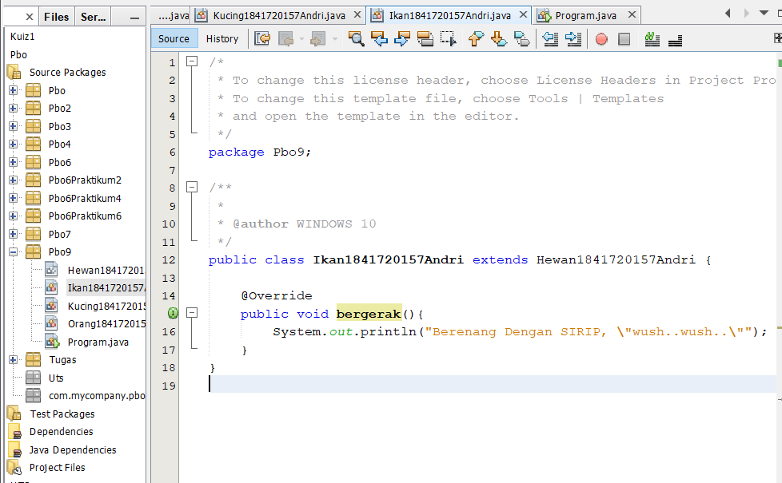
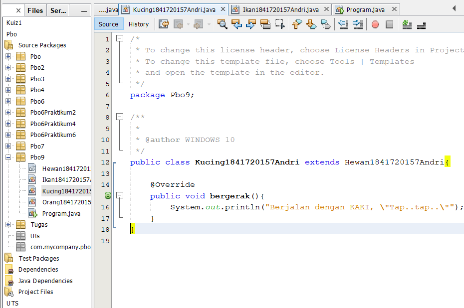
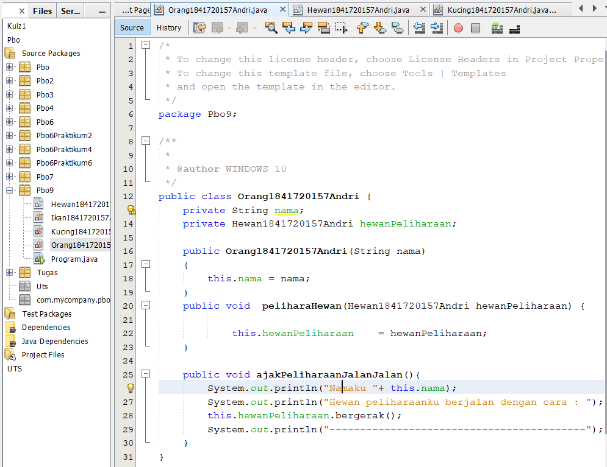
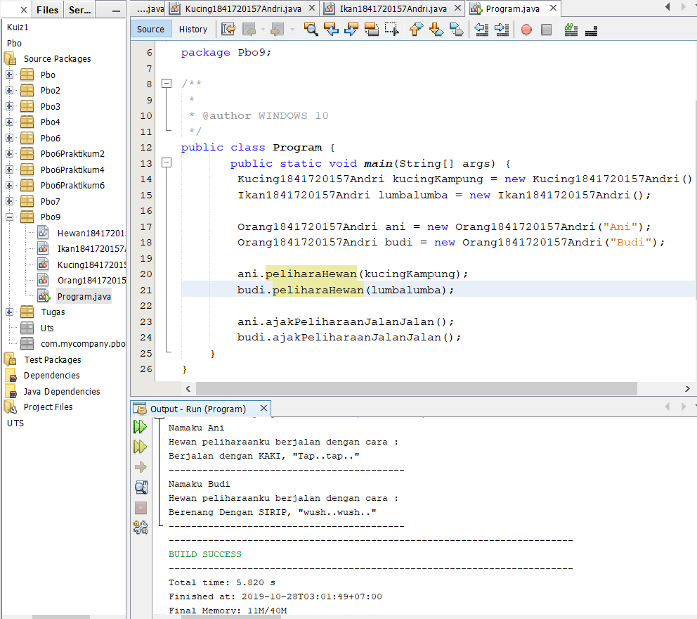

link kode program : [Program 1](../../src/9_Abstract_Class_dan_Interface/Hewan1841720157Andri.java)

link kode program : [Program 2](../../src/9_Abstract_Class_dan_Interface/Ikan1841720157Andri.java)

link kode program : [Program 3](../../src/9_Abstract_Class_dan_Interface/Kucing1841720157Andri.java)

link kode program : [Program 4](../../src/9_Abstract_Class_dan_Interface/Orang1841720157Andri.java)

link kode program : [Program 5](../../src/9_Abstract_Class_dan_Interface/Program1841720157Andri.java)

## pertanyaan
Bolehkah apabila sebuah class yang meng-extend suatu abstract class tidak mengimplementasikan method abstract yang ada di class induknya? Buktikan!

Jawab:

Tidak boleh, akan muncul error, karena abstract class merupakan class yang memiliki
perlakuan yang sama. Jadi jika suatu class mengextend abstract class tetapi tidak dilakukan
implementasi method abstractnya maka akan error.

### Percobaan 2 (Interface)

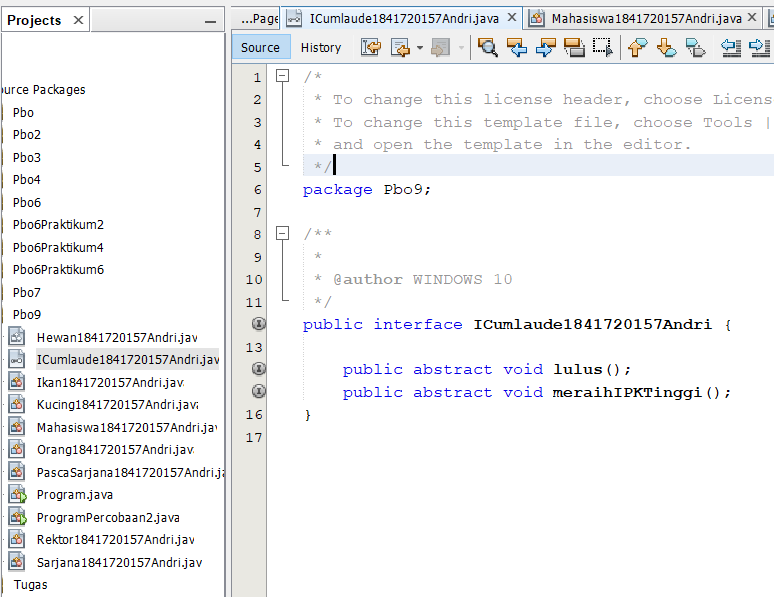
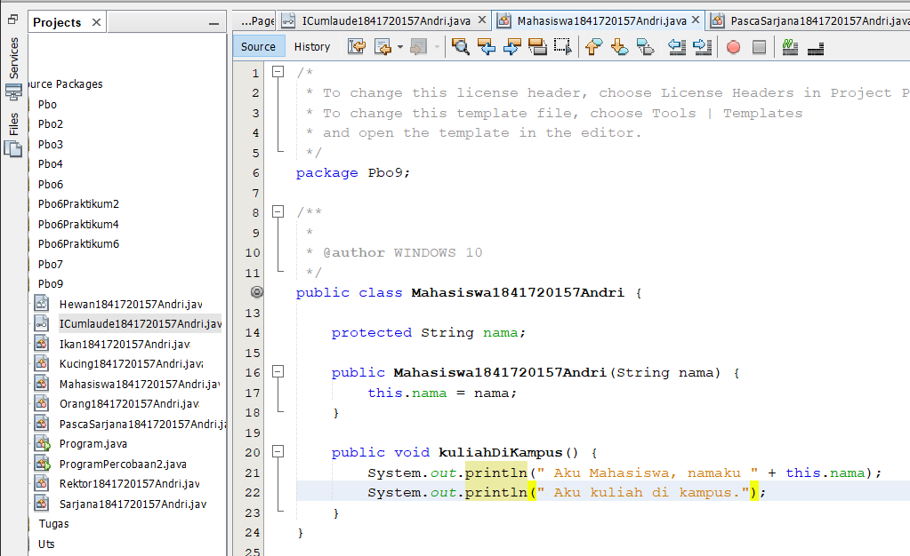
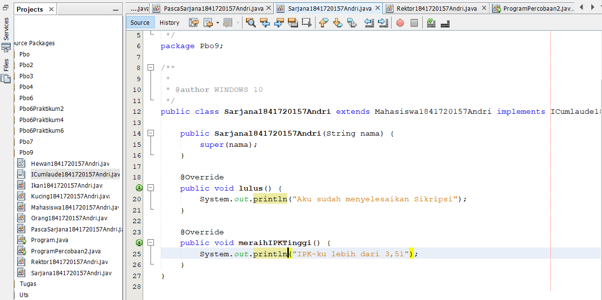
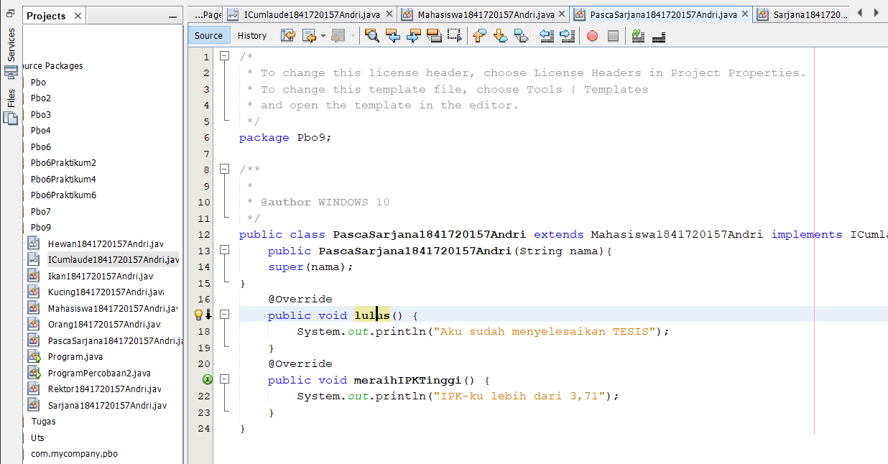
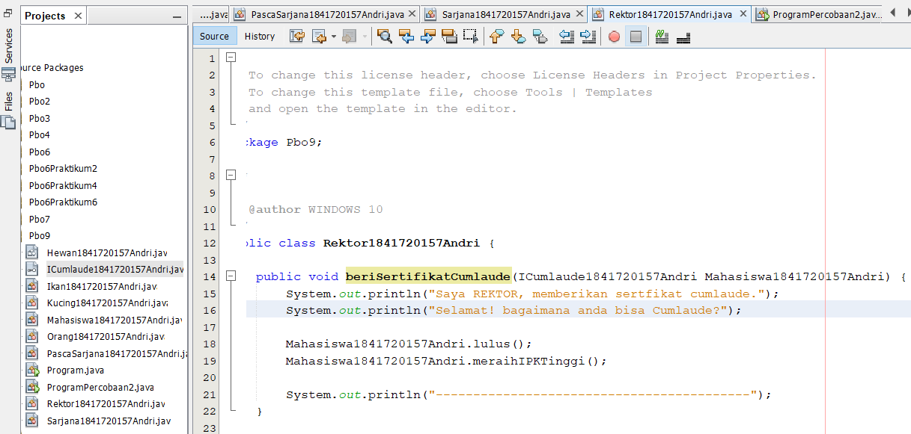
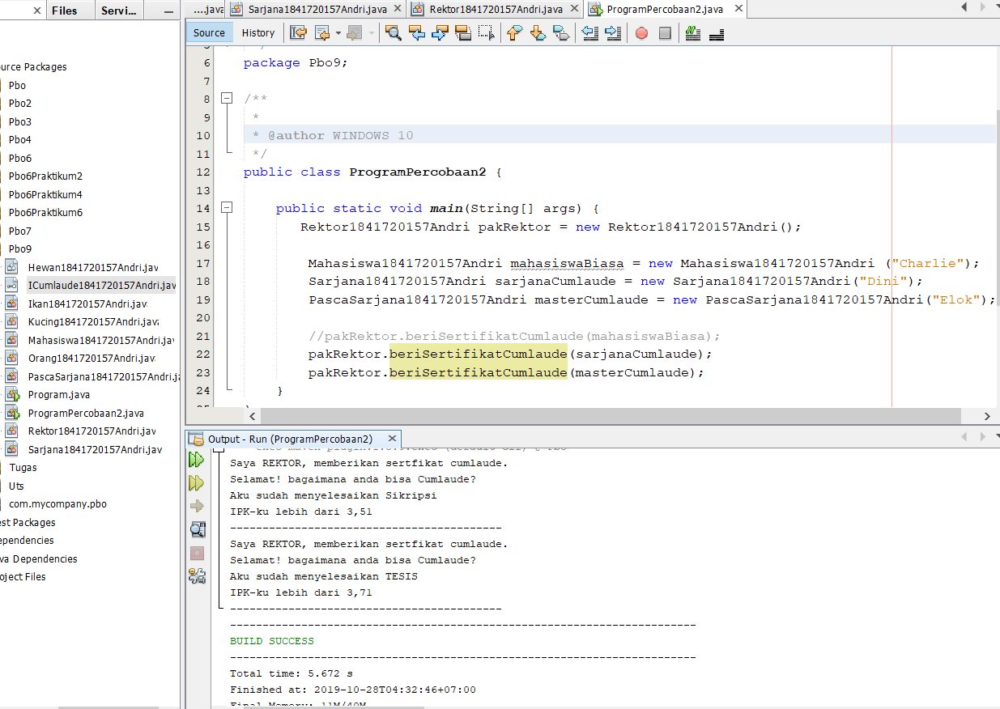

link kode program : [Program 1](../../src/9_Abstract_Class_dan_Interface/ICumlaude1841720157Andri.java)

link kode program : [Program 2](../../src/9_Abstract_Class_dan_Interface/Mahasiswa1841720157Andri.java)

link kode program : [Program 3](../../src/9_Abstract_Class_dan_Interface/Sarjana1841720157Andri.java)

link kode program : [Program 4](../../src/9_Abstract_Class_dan_Interface/PascaSarjana1841720157Andri.java)

link kode program : [Program 5](../../src/9_Abstract_Class_dan_Interface/Rektor1841720157Andri.java)

link kode program : [Program 6](../../src/9_Abstract_Class_dan_Interface/ProgramPercobaan2.java)

## Pertanyaan
Soal
1. Mengapa pada langkah nomor 9 terjadi error? Jelaskan!
2. Dapatkah method kuliahDiKampus() dipanggil dari objek sarjanaCumlaude di class
Program? Mengapa demikian?
3. Dapatkah method kuliahDiKampus() dipanggil dari parameter mahasiswa di method
beriSertifikatCumlaude() pada class Rektor? Mengapa demikian?
4. Modifikasilah method beriSertifikatCumlaude() pada class Rektor agar hasil eksekusi
class Program menjadi seperti berikut ini:

Jawab:

1. karena pada Class Mahasiswa hanya ada method “kuliahDiKampus”
sedangkan pada Class Interface dipanggil hanya 2 method yaitu “lulus” dan
“meraihIPKTertinggi”.Maka otomatis akan terjadi Error!
2. Bisa, karena class Sarjana telah di Instansiasi pada Class Program yaitu SarjanaCumlaude dan Class Sarjana telah meng-extends Class Mahasiswa
3. Bisa, dengan cara menambahkan method kuliahDiKampus() pada class interface ICumlaude dan pada class rektor ditambahkan method kuliahDiKampus() juga.
4. Bisa , dengan cara pada Class interface ICumlaude ditambahkan method
kuliahDiKampus(),Lalu pada Class Rektor ditambahkan pula method
kuliahDiKampus();

### Percobaan 3 (Multiple Interfaces Implementation)

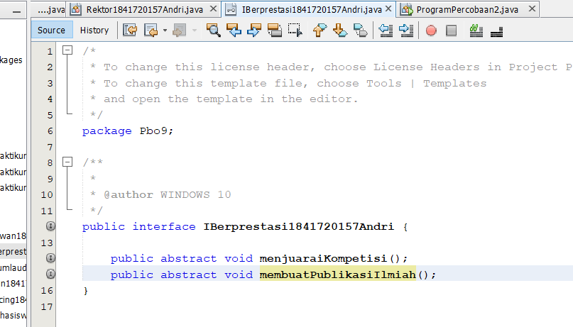
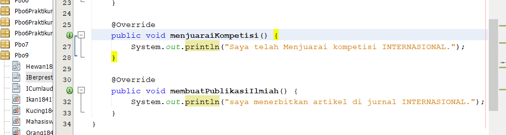
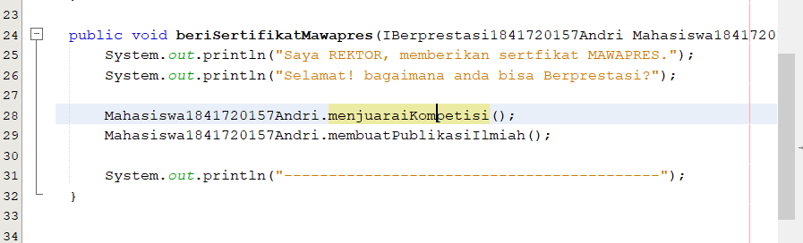
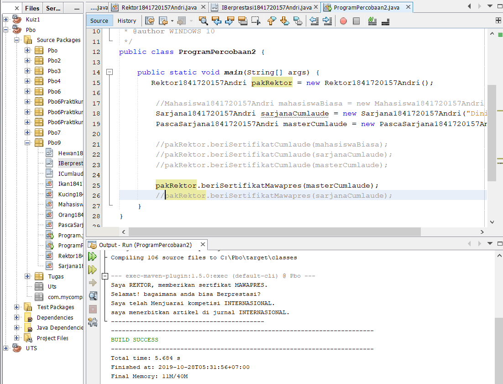

link kode program : [Program 1](../../src/9_Abstract_Class_dan_Interface/percobaan3/ICumlaude1841720157Andri.java)

link kode program : [Program 2](../../src/9_Abstract_Class_dan_Interface/percobaan3/Mahasiswa1841720157Andri.java)

link kode program : [Program 3](../../src/9_Abstract_Class_dan_Interface/percobaan3/Sarjana1841720157Andri.java)

link kode program : [Program 4](../../src/9_Abstract_Class_dan_Interface/percobaan3/PascaSarjana1841720157Andri.java)

link kode program : [Program 5](../../src/9_Abstract_Class_dan_Interface/percobaan3/Rektor1841720157Andri.java)

link kode program : [Program 6](../../src/9_Abstract_Class_dan_Interface/percobaan3/ProgramPercobaan2.java)

### Pertanyaan
1. 
Jawab:
1. 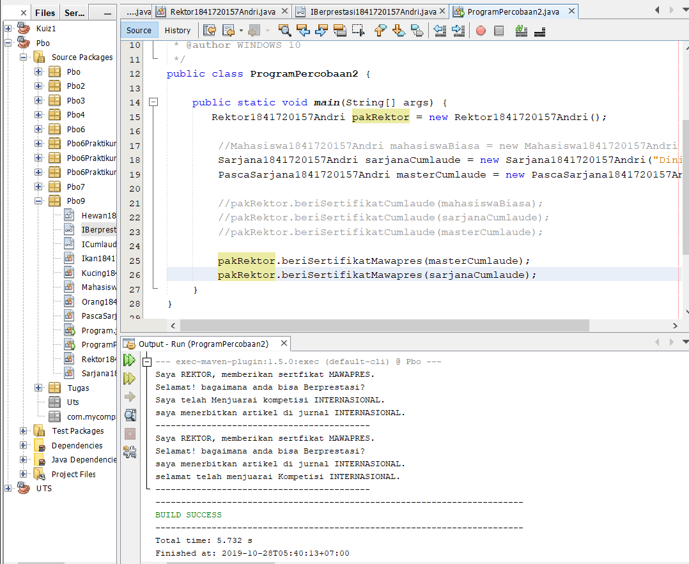 
link kode program : [Program](../../src/9_Abstract_Class_dan_Interface/pertanyaan/ProgramPercobaan2.java)

## Kesimpulan

Abstract Class adalah class yang tidak dapat diinstansiasi namun dapat di-extend. Abstract class baru dapat dimanfaatkan ketika ia di-extend sedangkan Interface adalah struktur data yang hanya berisi abstract methods. Tidak ada apa-apa selain method abstract pada interface, termasuk atribut getter dan setter

## Pernyataan Diri

Saya menyatakan isi tugas, kode program, dan laporan praktikum ini dibuat oleh saya sendiri. Saya tidak melakukan plagiasi, kecurangan, menyalin/menggandakan milik orang lain.

Jika saya melakukan plagiasi, kecurangan, atau melanggar hak kekayaan intelektual, saya siap untuk mendapat sanksi atau hukuman sesuai peraturan perundang-undangan yang berlaku.

Ttd,

***(ANDRI YOGA SUSILA)***